# Konwersja wdrożenia ręcznego na wdrożenie deklaratywne YAML
wzbogacono obraz o 4 repliki oraz rozpoczecie wdrożenia 
`kubectl apply -f lab11.yaml`
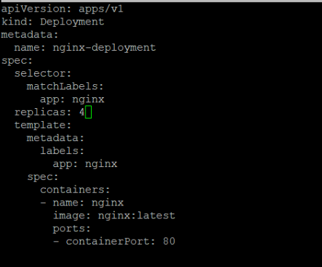
w dashboardzie:
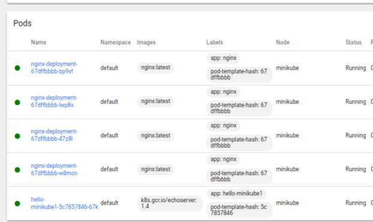
`kubectl rollout status deployment nginx-deployment`,  sprawdzenie stanu pliku.
## Przygotowanie nowego obrazu
wersja obrazu niginx: `nginx:1.14.2`
## Zmiany w deploymencie
zmniejszenie liczby replik do 1
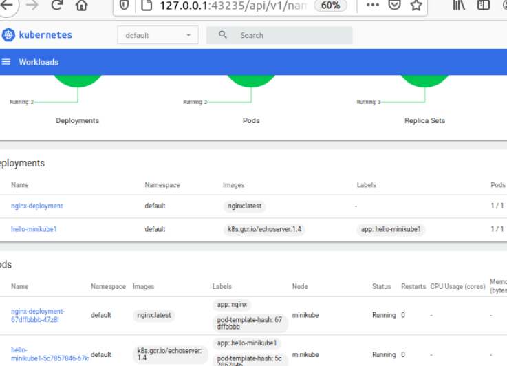
zmniejszenie liczby replik do 0
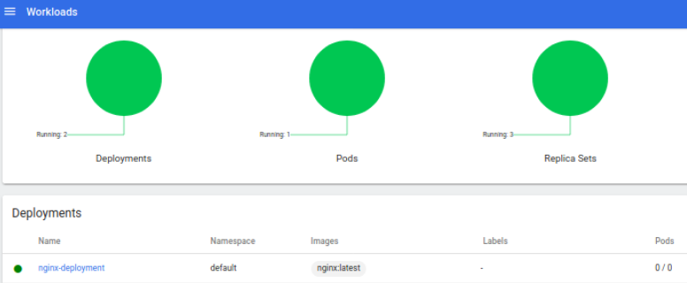
zastosowanie nowej wersji obrazu (powyżej - wersja latest)
zastosowanie starszej wersji obrazu (nginx:1.14.2)
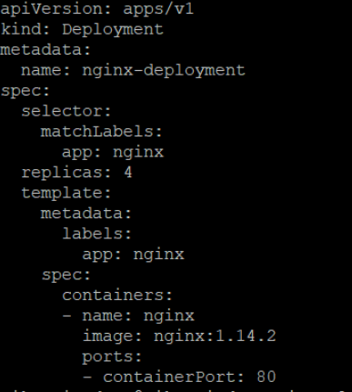
nadtepne polecenia
`kubectl rollout history deployment/nginx-deployment`
`kubectl rollout undo deployment/nginx-deployment`

 skrypt `script.sh`, weryfikuje czy wdrożenie zaszło w czasie 60 sekund. Sprawdzane jest to przy użyciu kubectl rollout status deployment/nginx-deployment i sleep 60.
 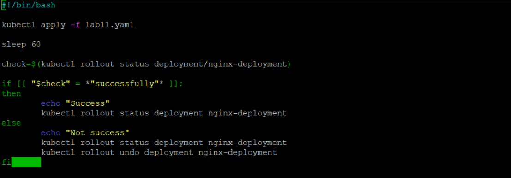
 ## Recreate
 zmiany w pliku yaml
 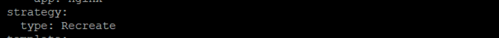
 `kubectl describe deployment nginx-deployment`
  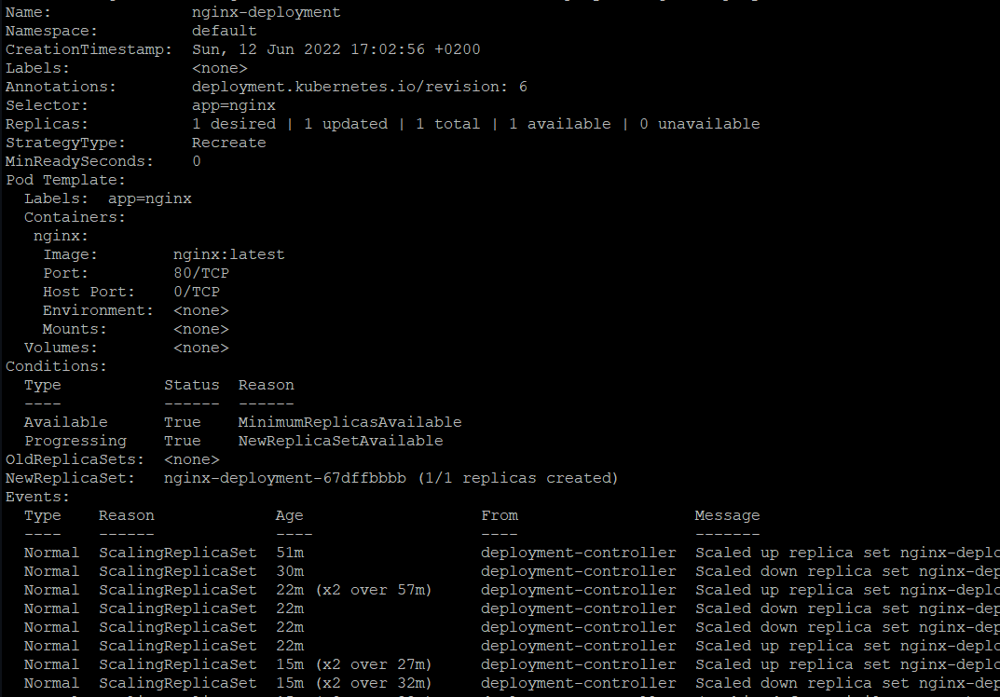
## RollingUpdate
analogiczna do poprzedniej zmiana w pliku yaml
 `kubectl describe deployment nginx-deployment`
  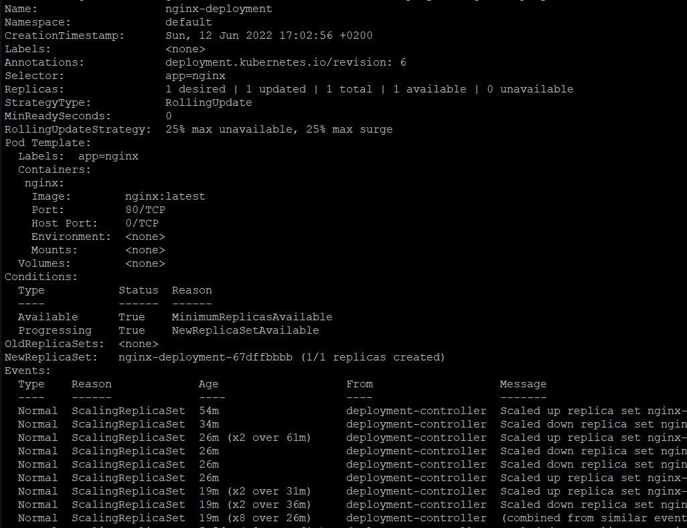
 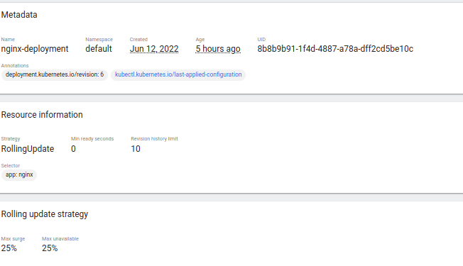
 ## Canary Deployment workload
  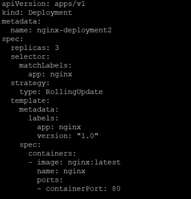
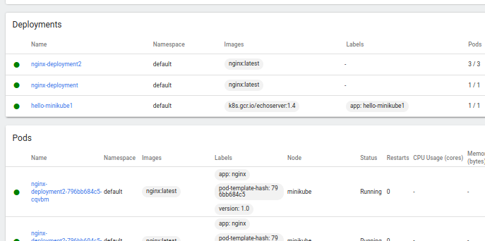
Recreate - strategia, w której ma miejsce zakończenie działania podów ze starą wersją zanim nastąpi zastąpienie nowszą, zapewniona zostaje ciągłość co do aktualizacji stanu aplikacji, znaczenie ma tu jednak czas przestoju wdrożenia

Rolling Update - charakterystyczne jest stopniowe aktualizowanie podów ze starą wersją

Canary Deployment workload - charakterystyczne podejście progresywne, gdzie jedna wersja aplikacji obsługuje większość użytkowników, natomiast nowsza wersja obsługuje użytkowników testowych (nowe oprogramowanie wdrażane obok starszych wersji)
