# Sprawozdanie Lab12
## Szymon Rewilak

0. Plik wdrożenia *nginx-deply.yaml* z poprzenich zajęć:

```
--- 
apiVersion: apps/v1
kind: Deployment
metadata: 
  labels: 
    app: nginx
  name: nginx-deployment
spec: 
  replicas: 2
  selector: 
    matchLabels: 
      app: nginx
  template: 
    metadata: 
      labels: 
        app: nginx
    spec: 
      containers: 
        - 
          image: "nginx:1.16"
          imagePullPolicy: Never
          name: nginx
          ports: 
            - 
              containerPort: 8080

```

1. Sprawdzono dostępne pod's. Są uruchomione dwa - z obrazami hello-world z poprzedniego laboratorium.

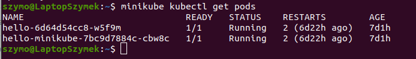  

2. Uruchomiono nowy pod z obrazem nginx:

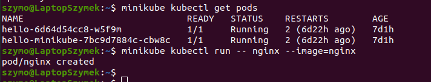   

  

3. Zrobiono przekierowanie na port 8080:  
   
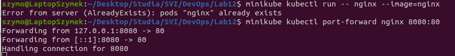    

4. Uruchomiono nginx na adresie *localhost:8080*:   

    

5. Następnie uruchomiono deployment z wykorzystaniem przygotowanego wcześniej pliku *.yaml*:    

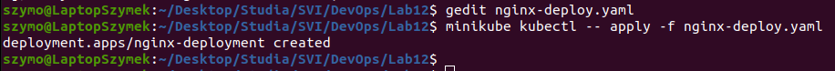  

Działający deployment na dashboardzie:

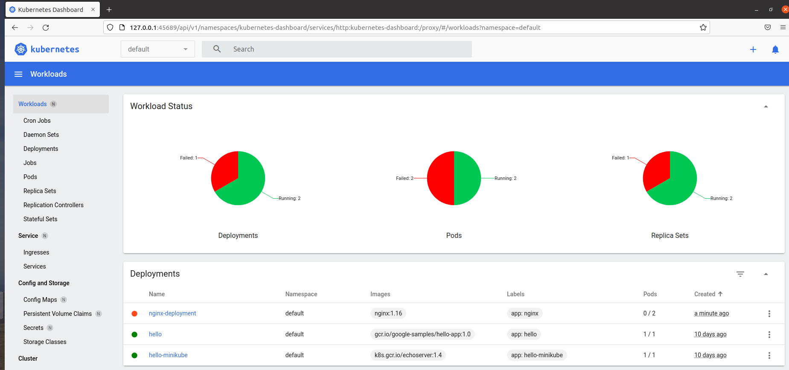

## Przygotowanie nowego obrazu

1. Przygotowano obraz wykorzystujący alpine:
```
FROM alpine:3.4

RUN apk update
RUN apk add vim
RUN apk add curl
```

2. Następnie utworzono obraz, który się zbuduje, lecz wyrzuci błąd przy uruchomieniu kontenera:
```
FROM alpine:3.4

RUN apk update
CMD apk -s BAD_COMMAND
```
3. Budowa działającego obrazu:  

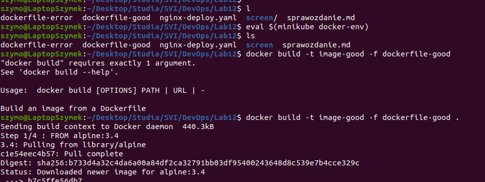
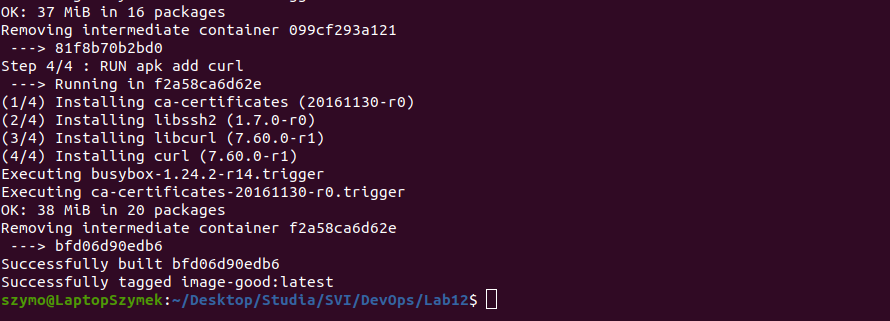  

4. Budowa niedziałającego obrazu:    

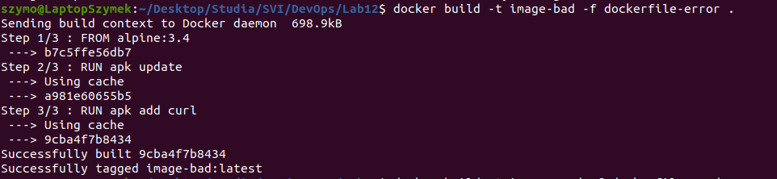  

5. Zbudowane obrazy:  

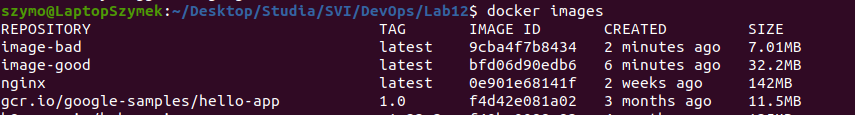  

6. Uruchomienie błędnego obrazu kończy się błędem:

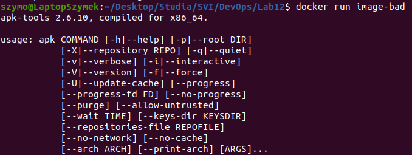  

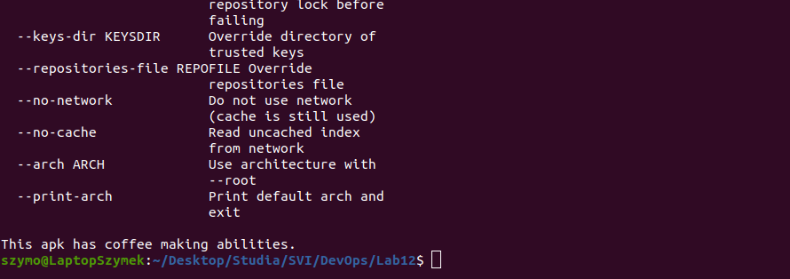  


## Zmiany w deploymencie

1. Zmieniono liczbę replik na 6:  

  

Uruchomienie:

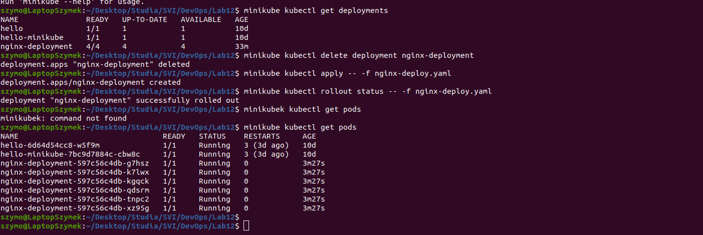

2. Zmniejszono liczbę replik do 1:
   
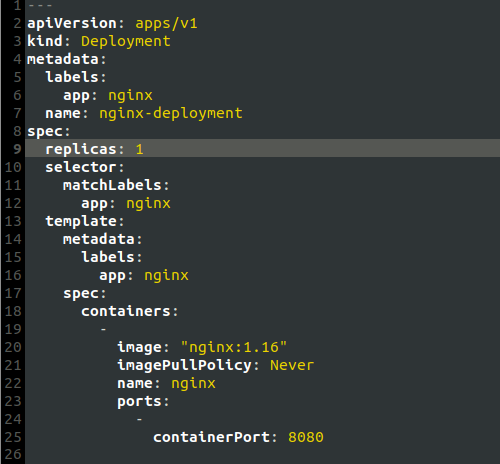

Uruchomienie:

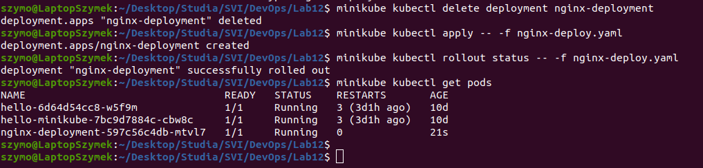

3. Zmniejszono liczbę replik do 0:  

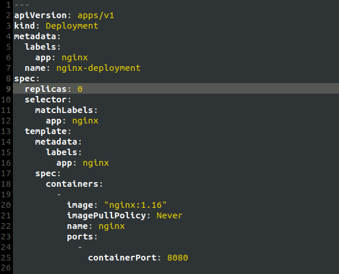

Uruchomienie:

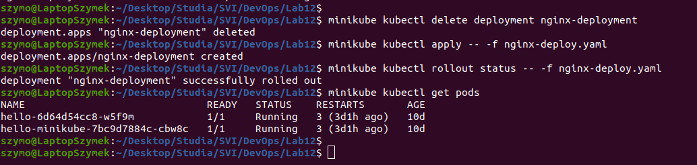

4. Zmiana obrazu na *image-good*:

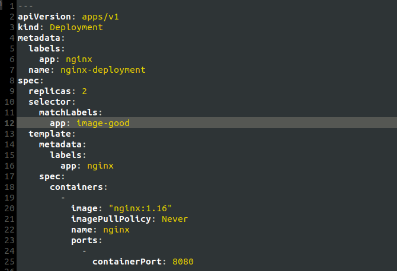

Uruchomienie:

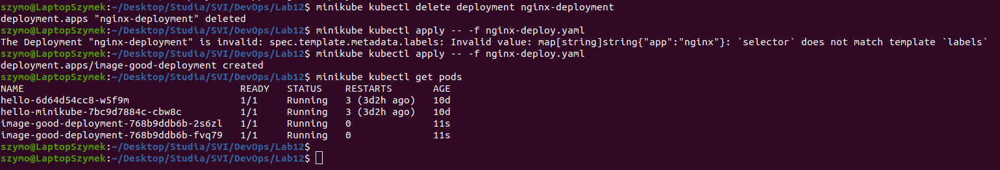


5. Zmiana obrazu na *image-error*:  
   


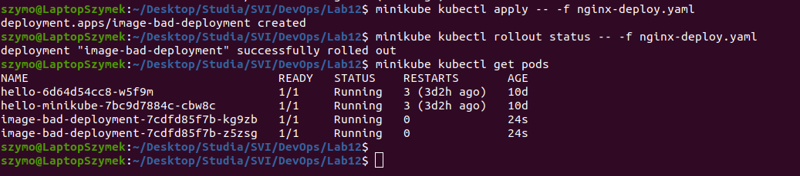

Uruchomienie:


## Strategie wdrożenia: 

1. **Recreate**  
W tej strategii w miejsce starego deploymentu publikowany jest nowy:

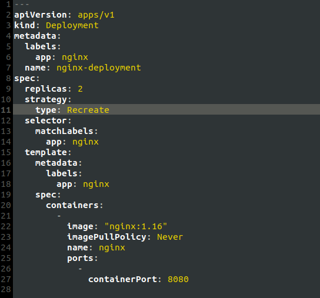

Dzięki wykorzystaniu tej strategii nie jest konieczne usuwanie starego deploymentu przy publikowaniu nowego:

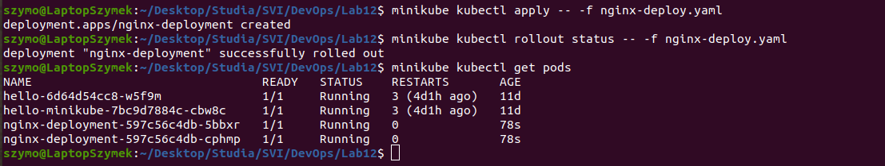

2. **Rolling Update**

W tej strategii stare pody są ubijane, a następnie uruchamiane jeszcze raz.  
Zmieniono liczbę maksymalnej liczby podów działających naraz na 2 (*maxSurge*) oraz maksymalną liczbę niedziałających podów (*maxUnavailable*)  
Liczbę replik ustawiono na 3, celem zweryfikowania działania strategii:  

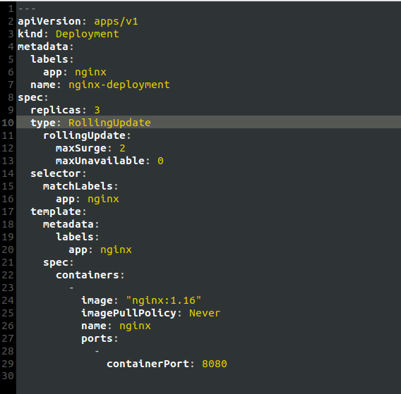

Uruchomienie:

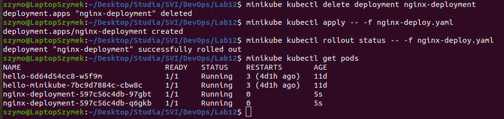

Jak widać, zostały utworzone 2 repliki, choć w specyfikacji założono liczbę replik równą 3.

3. **Canary** **Deployment** **workload**

Ta strategia polega na uruchomieniu dwóch podów, z czego jeden jest uruchomiomny w starej, a drugi w nowej wersji. Dzięki temu można w bezpieczny sposób wprowadzać zmiany do deploymentu, bez ryzyka utraty stabilnej wersji.