## **LAB12 - Weronika Rusinek - ITE  403038 gr lab 7**


#   Konwersja wdrożenia ręcznego na wdrożenie deklaratywne YAML

1. Wzbogacenie obrazu o 4 repliki dokonane w pliku `.yaml` poprzez zmienienie parametru `replicas` na  4. 

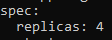

2. Rozpoczynam wdrożenie za pomocą `kubectl apply` i z użyciem pliku stworzonego na poprzednich zajeciach `deploy.yaml` ze zmodyfikowaną wartością replik.

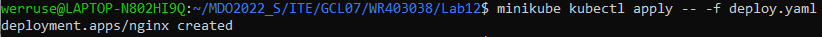
3. Sprawdzam stan wdrożenia za pomocą `kubectl rollout status`

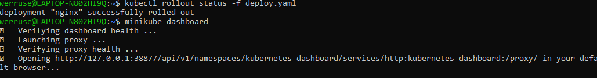
4. Sprawdzam wdrożenie na dashboardzie: 

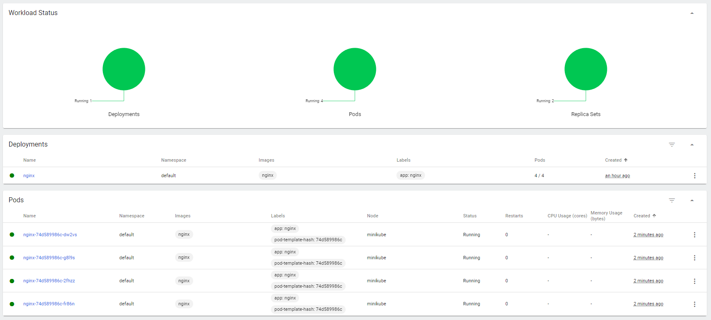


# Przygotowanie nowego obrazu 

Korzystam z obrazu-gotowca tak jak w przypadku poprzedniego laboratorium, bazując na nim przygotowuje dwa obrazy lokalnie poprzez `docker build`. Definiuję dwa Dockerfile - `Dockerfileok` oraz `Dockerfilenook`, które będą je wdrażać. W jednym z nich celowo popełniam błąd aby wdrożenie nie kończyło się sukcesem. 
Obrazy nazywam kolejno: `ok` oraz `nook`. 

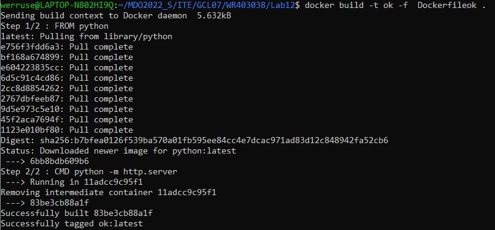

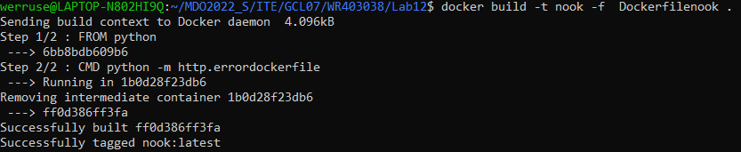

Błędny obraz:

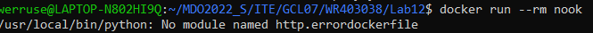

# Zmiany w deploymencie

Aktualizuję plik YAML z wdrożeniem i przeprowadzam je ponownie po:
Przy zmianach dotyczących replik w pliku YAML zmieniam wartość parametru `replicas`
Po wdrożeniu sprawdzam również pody `minikube kubectl get pods` aby podejrzeć czy wykonało się zgodnie z założeniem.

***- zwiększeniu replik***
`replicas = 8`
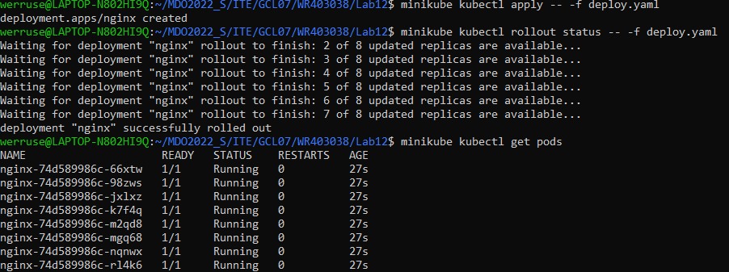

***- zmniejszenie liczby replik do 1***
`replicas = 1`
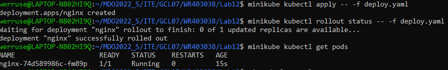

***- zmniejszenie liczby replik do 0***
`replicas = 0`
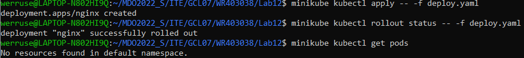

# Kontrola wdrożenia

Skrypt weryfikujący, czy wdrożenie "zdążyło" się wykonać w ciągu 60 sekund:

- Rozpoczynam od wrzucenia do skryptu wszystkich poleceń, które wykonywałam do tej pory związanych ze wdrożeniem:  delete, apply, rollout. 
- Komendą `timeout 60` na rolloucie kontroluję to czy wdrożenie wykonało się poprawnie. Jeśli w ciągu 60s wykona się poprawnie zostaje wyświetlony odpowiedni komunikat, jeśli nie to użytkownik również jest o tym poinformowany.
```
#!/bin/bash

minikube kubectl delete deploy nginx
minikube kubectl apply -- -f deploy.yaml
timeout 60 minikube kubectl rollout status -- -f deploy.yaml
if [ $? -eq 0 ]
then
    echo "Successful deployment"
else
    echo  "Deployment failed"
fi
```
Przykład działania:

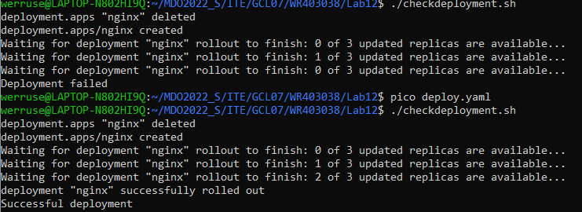


# Strategie wdrożenia

Dokonując zmian strategii wdrożenia należało w sekcji `spec` dodać `strategy` i ustawić odpowiedni `type`. 

```
spec:

	replicas: liczba_replik

	strategy:

		type: odpowiedni_typ
```

|Recreate  |  Rolling Update | 
|--|--|
| **`type: Recreate`** | **```type: RollingUpdate                                       rollingUpdate: maxSurge: value                                                                                   maxUnavaliable: value ```**
|W miejsce starej-ubitej wersji wdrażana jest nowa. Sprawdzałam tą strategie przy wykorzystaniu 3 replik |   Występuje tutaj progresywność podów, są wyłączane, a następnie uruchamiane. W ich definicji mamy dwie etykiety: `maxSurge` - maksymalna ilość podów któe mogą zostać dodane oraz `maxUnavailable` - maksymalna ilość które mogą być niedostępne. W swoim przykładzie przedstawiam wdrożenie w któym możemy mieć 2 dodane pody oraz 0 niedostępnych. Ogólna ilość replik: 8. 
| 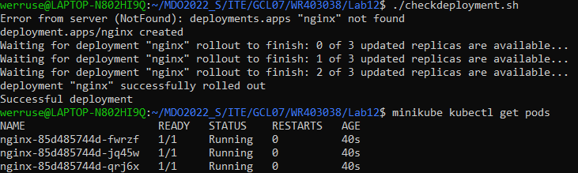  | 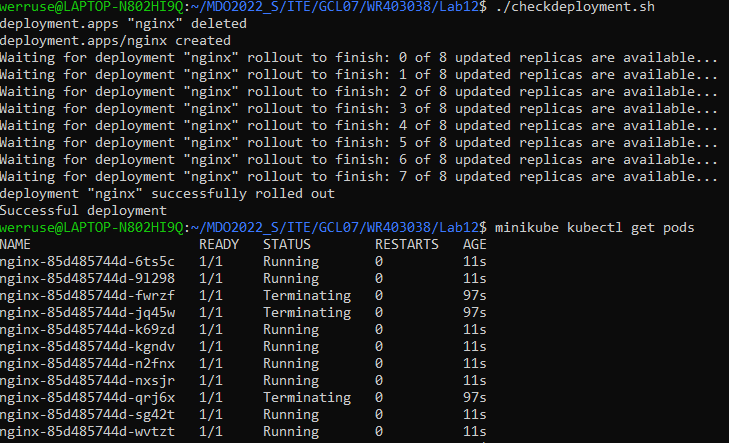
