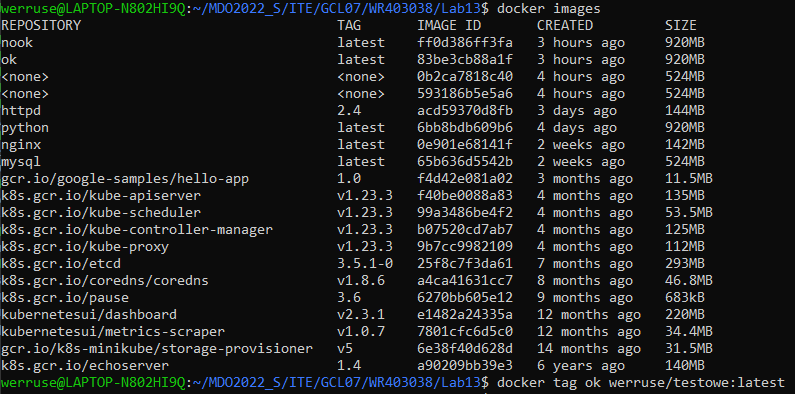
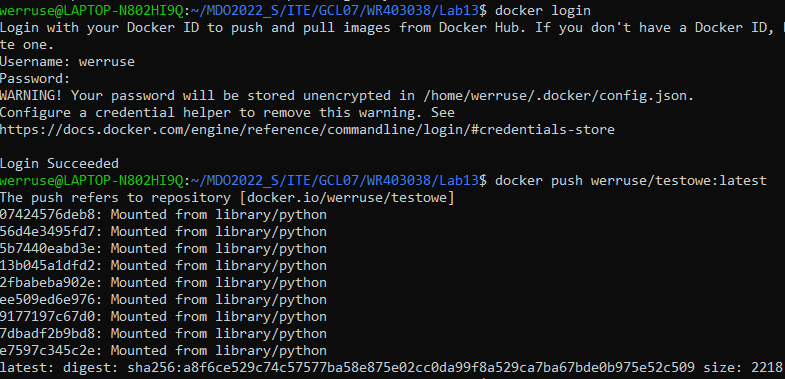
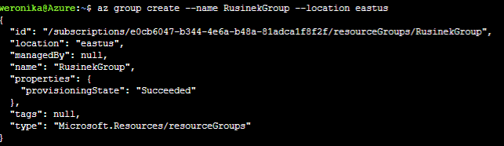
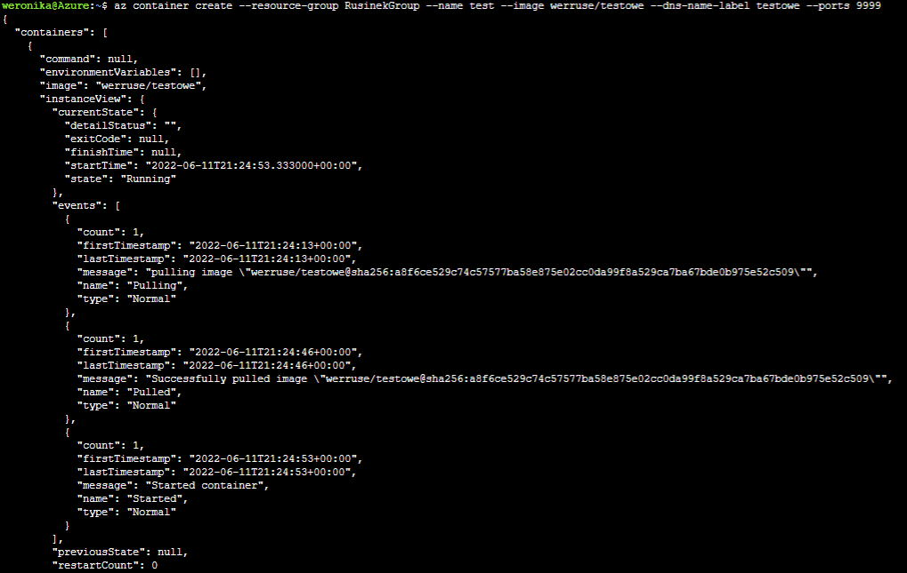
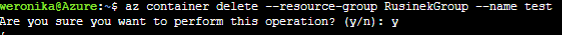
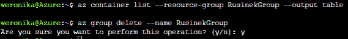

## **LAB13 - Weronika Rusinek - ITE  403038 gr lab 7**

#   Przygotowanie kontenera

Na potrzeby zadania wypchnęłam kontener użyty na zajęciach 12 na DockerHuba.

# Zapoznanie z platformą

Odblokowałam konto studenckie, zapoznałam się z cennikiem i przeszłam do wdrażania kontenera w ACS.

- Stworzyłam grupę zasobów za pomocą komendy: `az group create --name RusinekGroup --location eastus`

- Utworzyłam kontener za pomocą komendy: `az container create --resource-group RusinekGroup --name test --image werruse/testowe --dns-name-label testowe --ports 9999`

- Usunęłam kontener: `az container delete --resource-group RusinekGroup --name test`

