# Sprawozdanie Lab09 Bartosz Tonderski
#### Cel laboratorium : 
Przeprowadznie instalacji wygenerowanego artefaktu pod niezależnym systemem oraz przeprowadzenie nienazdorowanej instalacji systemu z zależnościami oraz oprogramowaniem.

## Wykonanie 
### Instalacja Fedora serwer

Zainstalowanie fedora netinstall 36 z następującą konfiguracją:
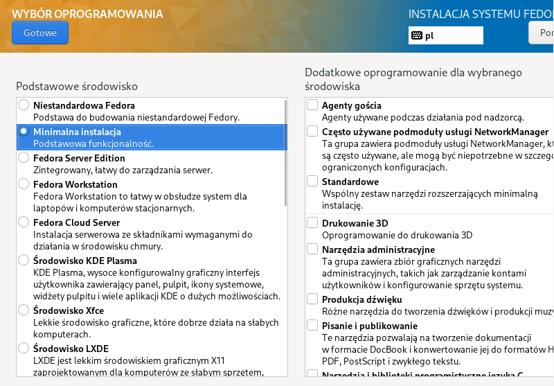
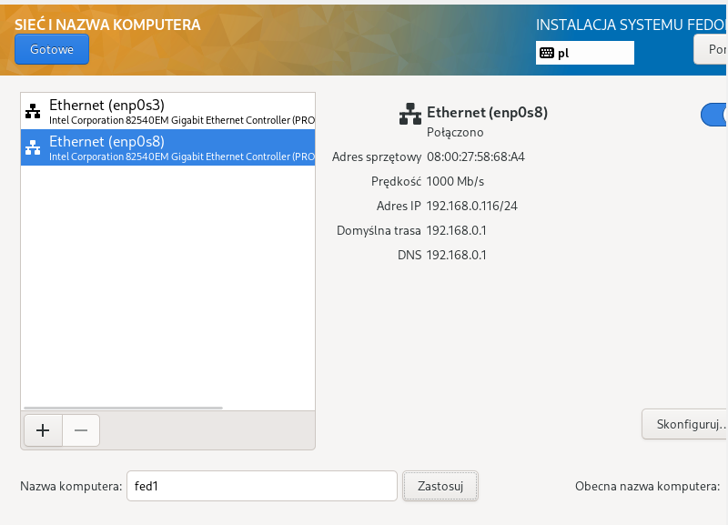
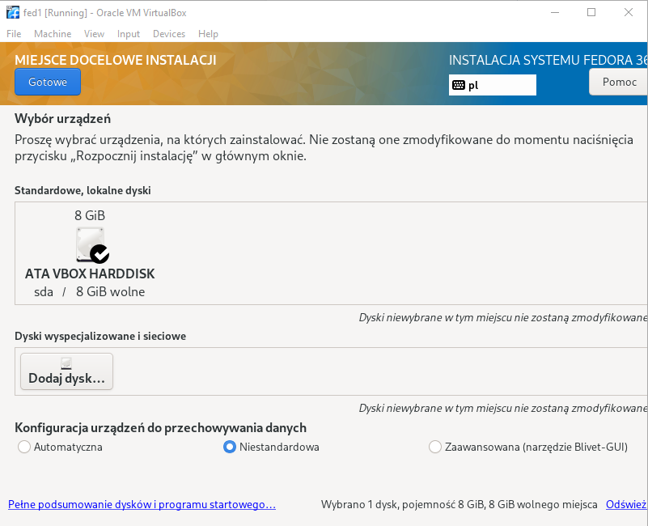

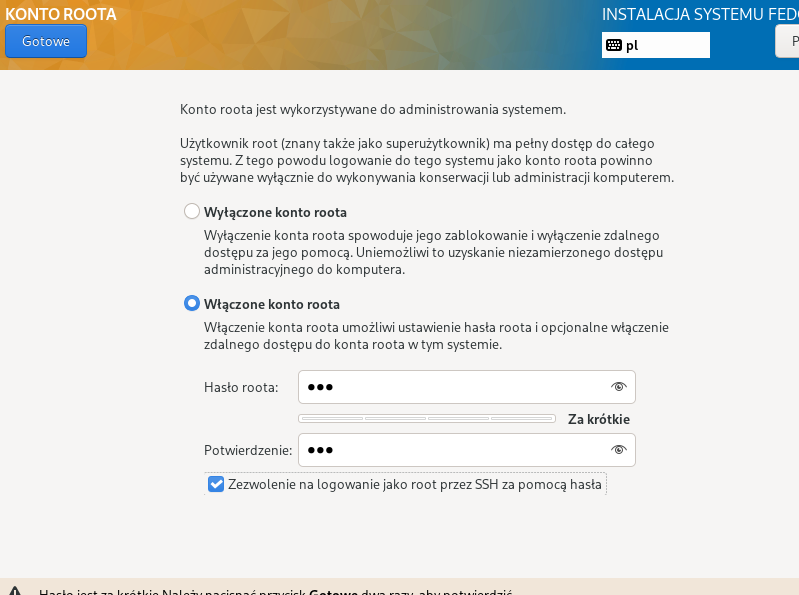

Wyswietlenie adresu ip w celu połączenia się z winSCP oraz pobranie anaconda-ks.cfg

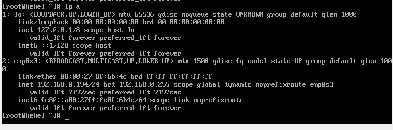
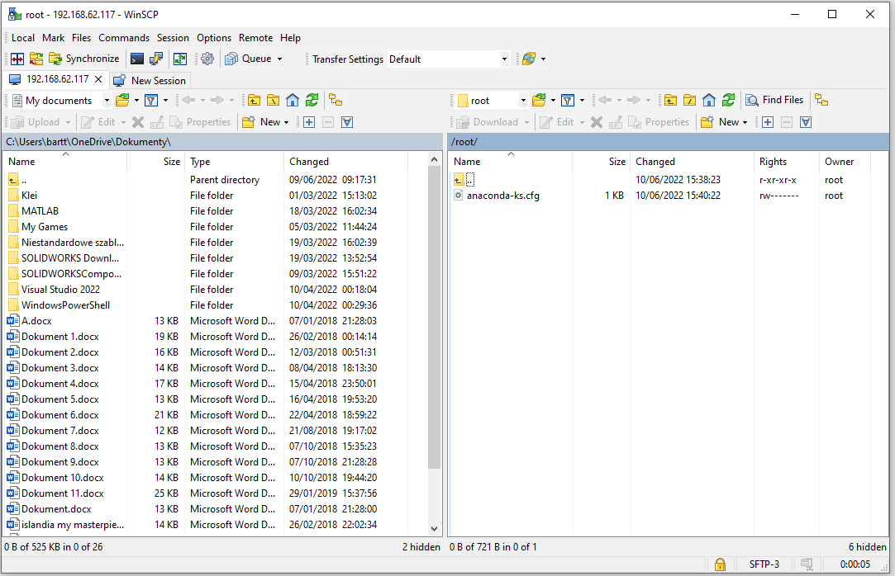

### Instalacja potrzebnych rzeczy na serwerze 
Instalacja obrazu klienta oraz serwera odbywała się identycznie z różnicą nazwy systemu.

#### instalacja http deamon
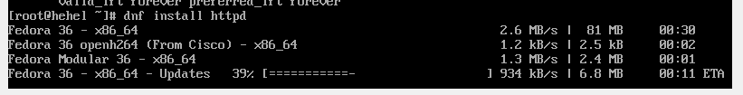
#### ustawienia firewall'a
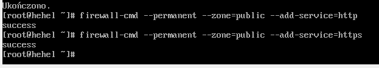
#### uruchomienie usług http oraz sprawdzenie dzialania
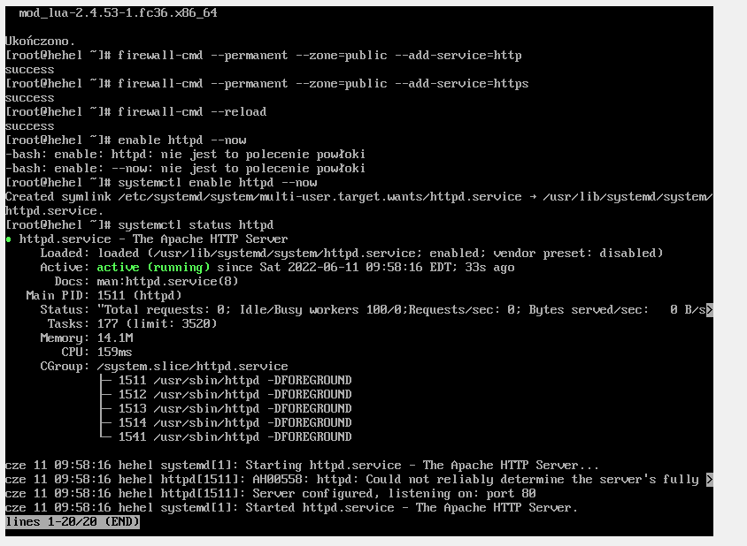

Sprawdzenie ip odbyło się jak przy poprzednim systemie

#### utworzenie katalogu na serwerze

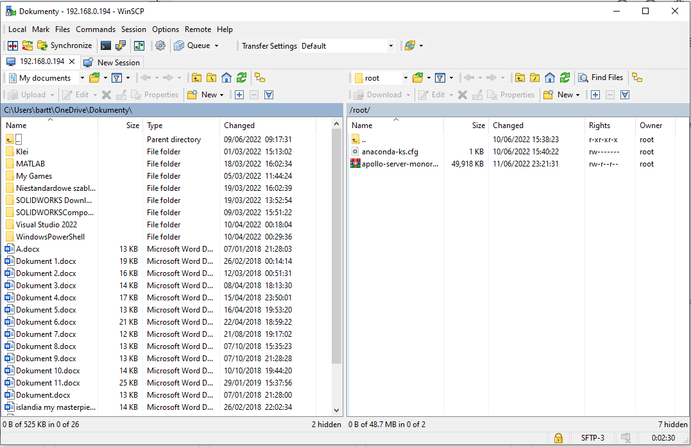
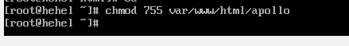
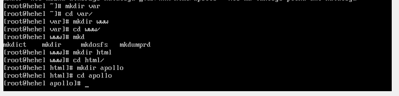

### instalacja wget na kliencie

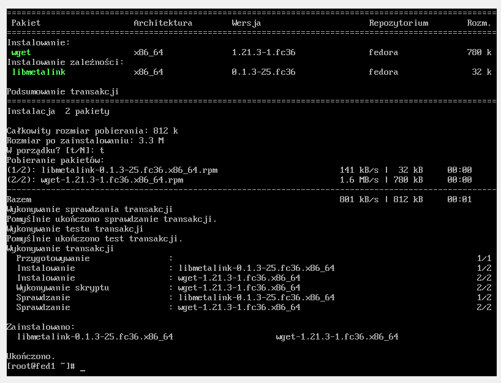

#### Pobranie artefaktu za pomocą wget

#### instalacja pakietu za pomoca npm 

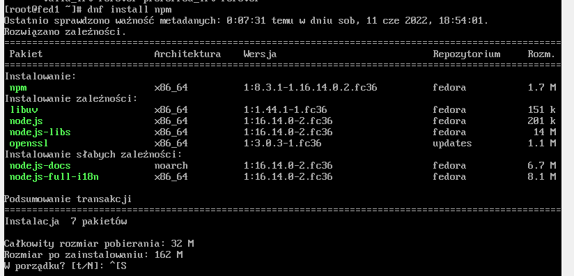

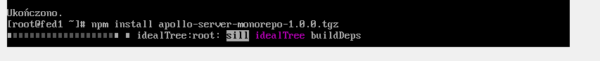

## Instalacja nienadzorowana

Modyfikacja pliku anaconda_kf.cfg oraz umiejscowanie go na githubie

[anaconda_ks.cfg](./anaconda-ks.cfg)

Zamontowanie iso Fedory w systemie

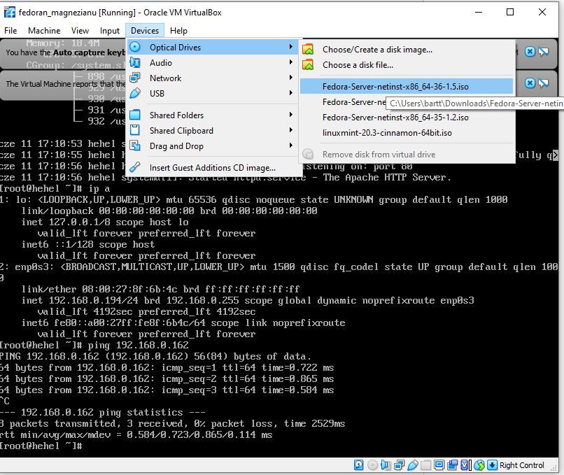

Utworzenie katalogow roboczych oraz zamontowanie obrazu

Modyfikacja pliku isolinux.cfg

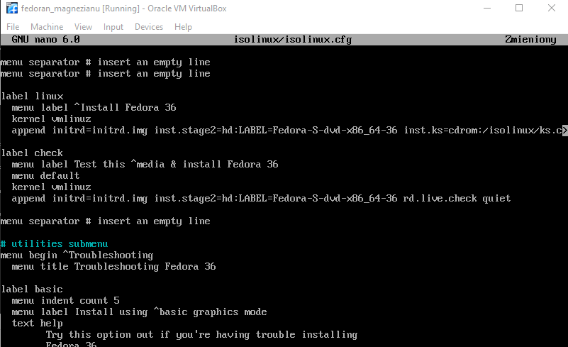

Instalacja Geniso

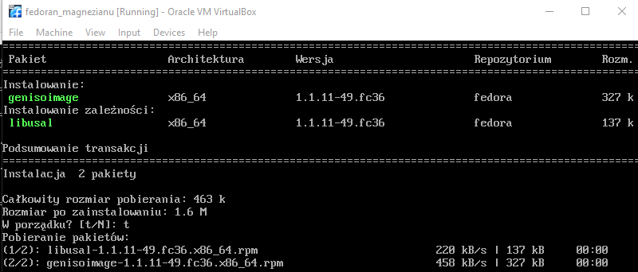

Uruchomienie Generowania obrazu za pomoca geniso poniższa komendą

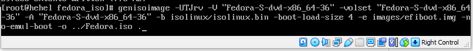

Powstanie obrazu iso

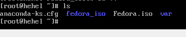

#### Przy uruchomieniu maszyny trzeba zwrócić uwagę aby dysk był tego samego rozmiaru bądź większy, inaczej instalacja może się nie powieść.