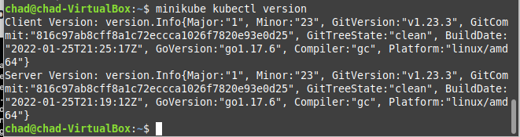
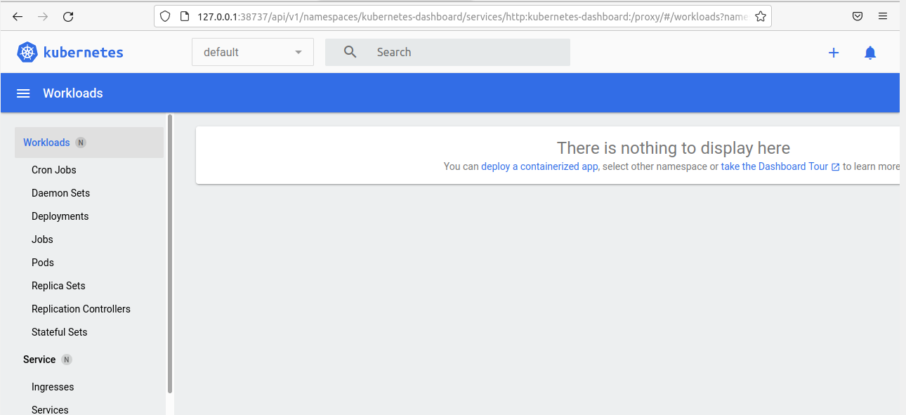
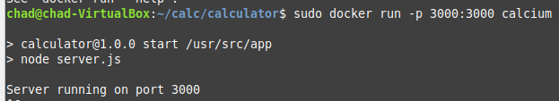
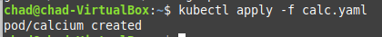
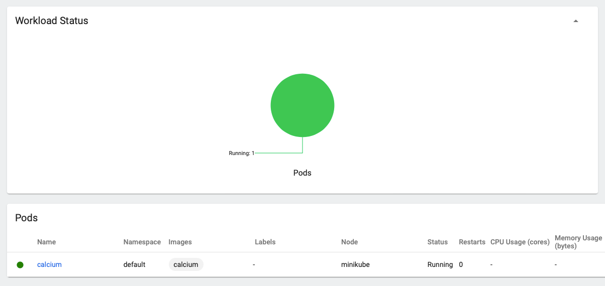
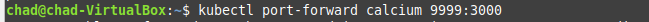
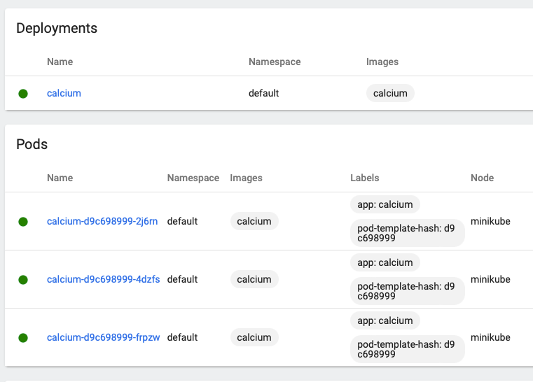
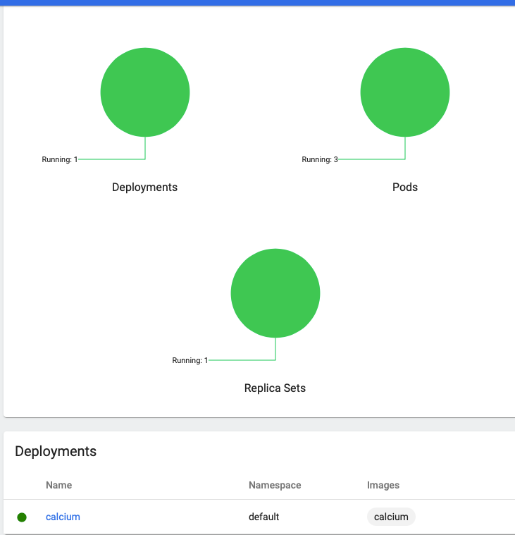

# Lab11 Bartosz Tonderski

## Instalacja minikube

### Instalacja przebiegała jak opisano w dokumentacji minikube
### Jedyna róznica polegała w komendzie uruchamiającej.
``kubectl start --driver=docker``

### zainstalowany kubectl:



### Uruchomienie dashboarda

``kubectl dashboard``




## Przygotowanie Dockera oraz obrazu do uruchomienia w pod'ach

### zbudowanie obrazu Docker za pomoca dockerfile przygotowanego przez deploy


```Dockerfile
FROM node:10

WORKDIR /usr/src/app

COPY package*.json ./

RUN npm ci --only=production
COPY . .

EXPOSE 3000
CMD [ "npm", "start" ]

```


## URuchomienie aplikacji z obrazu w Docker




## Utworzenie poda

```Yaml
apiVersion: v1
kind: Pod
metadata:
  name: calcium
spec:
  containers:
  - name: calcium
    image: calcium
    imagePullPolicy: Never
    ports:
    - containerPort: 3000
    command: ["/bin/bash","-c","cd calculator && npm start"]
```





## Forward portów



## deploy

### Yaml deploya:

```Yaml
apiVersion: apps/v1
kind: Deployment
metadata:
  name: calcium
  labels:
    app: calcium
spec:
  replicas: 3
  selector:
    matchLabels:
      app: calcium
  template:
    metadata:
      labels:
        app: calcium
    spec:
      containers:
      - name: calcium
        image: calcium
        imagePullPolicy: Never
        ports:
        - containerPort: 3000
```






