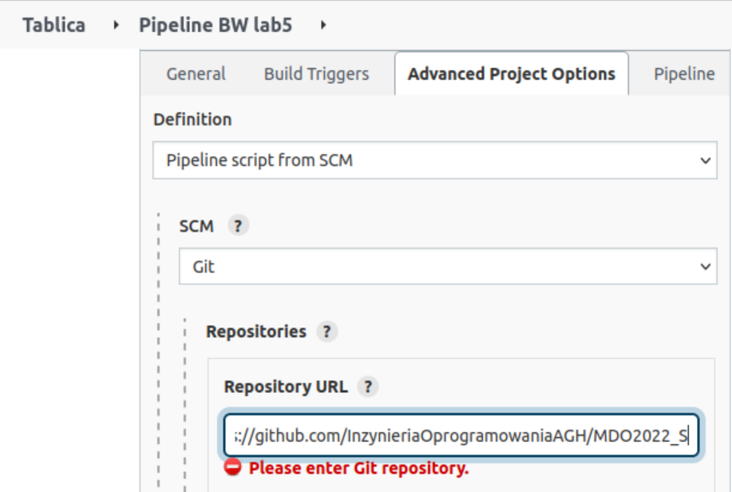
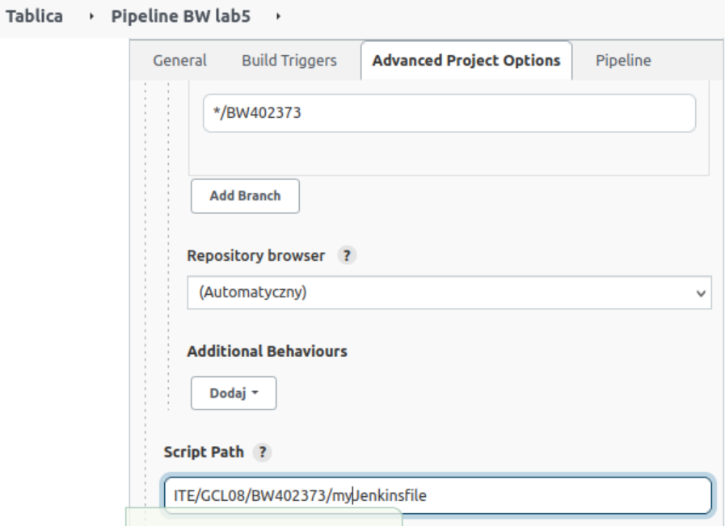
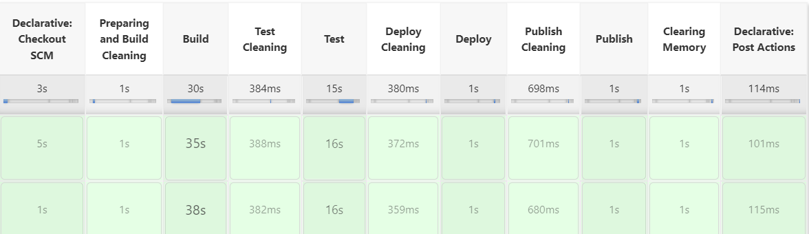

# Projekt pipeline'u
## Lab 05
### 1. Opis projektu<br>
Celem laboratorium było przygotowanie projektu z mozliwoscią automatycznego wykonania czynności wykonanych na poprzednich labolatoriach,
takich jak budowanie i testowanie oraz wdrożenie i publikowanie. W celu wykonania projektu zostaly stworzone dwa pliki Dockerfile. Dockerfile1 
zawiera polecenia potrzebne do sklonowania repozytorium, zainstalowania potrzebnych zależnosci jak i zbudowanie programu. Dockerfile2 zawiera 
polecenia uruchomiające testy przeprowadzone dla wybranego repozytorium. Deploy zostal przeprowadzony wewnątrz kontenera wykorzystując obraz Node. 
W kroku publish ze zbudowanego programu została stworzona paczka tar.tgz.<br>
### 2. Wykonanie projektu<br>
1. Konfiguracja pipeline odbywa się w zakładce "Konfiguracja". Po nadaniu nazwy projektowi w liście rozwijanej Definition należy wybrać ```Pipeline script from SCM```, 
z listy "SCM" wybrać ```Git```, a w URL wpisać link do repozytorium ```https://github.com/InzynieriaOprogramowaniaAGH/MDO2022_S```.<br>

2. W polu "Branch specifier" wpisać ```*/BW402373```, a następnie w "Script Path" wpisać ścieżkę do pliku Jenkinsowego z kodem Pipeline ```ITE/GCL08/BW402373/Lab05/Jenkinsfile```.

3. Pliki potrzebne do przygotowania pipeline<br>
Aby przejść do pisania pipline'u wymagane jest umieszczenie trzech plików dockerfile'owych 
na repozytorium i w branchu dodanym podczas konfiguracji pipeline'u.
Pierwszym z nich jest Dockerfile1 który klonuje repozytorium oraz przeprowadza instalację i budowanie projektu.<br>
```
FROM node:latest

RUN git clone https://github.com/mongo-express/mongo-express.git

WORKDIR mongo-express
RUN npm install
RUN npm run build
```
<br>
Plik Dockerfile2 odpowiada za uruchomienie testów znajdujących się w projekcie.
```
FROM bw_build:latest
WORKDIR mongo-express
RUN npm test
```

4. Zawartość pipeline<br>
1. Parameters<br>
Pipeline przyjmuje dwa parametry PROMOTE oraz VERSION. Parametr VERSION oznacza wersję wydawanego programu. Parametr określający wersję 
domyślnie ustawiony jest na 1.0.0 lecz przy każdym uruchomieniu pipeline'u istnieje możliwość zmiany wersji. 
Parametr PROMOTE decyduje czy sekcja Publish się wykona. Jeżeli wszystkie poprzednie etapy pipeline'u przejdą poprawnie i PROMOTE jest zaznaczone, 
sekcja Publish buduje publikowalny artefakt, o numerze wersji z parametru VERSION.
Sekcja agent konfiguruje, na których węzłach można uruchomić potok. Określenie agent any oznacza, że ​​Jenkins uruchomi zadanie na dowolnym z dostępnych węzłów.
```
parameters
    {
        string(name: 'VERSION', defaultValue: '1.0.0', description: '')
        booleanParam(name: 'PROMOTE', defaultValue: true, description: '')
    }

    agent any
```
2. Preparing and Build Cleaning.<br>
Tworzone są woluminy wejściowy i wyjściowy. W przypadku istnienia nieaktywnych woluminów są one usuwane, a kontenery są czyszczone.
```
stages
     {
     	stage('Preparing and Build Cleaning')
     	{
     	  steps
     	  {
     	    sh 'docker volume create input_vol'
            sh 'docker volume create output_vol'
            sh 'docker rm -f bw_build || true'
            sh 'docker volume prune -f'
     	  }
     	}
```

3. Build<br>
W tym kroku na początku zostanie wykonane sklonowanie i zbudowanie programu używając wyżej opisanego Dockerfile1,
które zostanie wykonane w kontenerze ```bw_build```, następnie zostanie on uruchomiony z podpiętym woluminem wejsciowym, 
na który zostaje skopiowana zawartość kontenera ze zbudowanym programem, po czym z kontenra wejściowego zawartość 
zostaje skopiowana na wolumin wyjsciowy. Na koniec zostają wyświetlone zawartości obu woluminow w celu sprawdzenia, czy kopiowanie przebiegło pomyślnie.
```
stage('Build') 
        {
            steps 
            {
              
              sh 'docker build . -f ./ITE/GCL08/BW402373/Lab05/Dockerfile1 -t bw_build'
  	      sh 'docker run --mount type=volume,src="bw_build",dst=/input_vol bw_build:latest bash -c "cd .. && cp -r /mongo-express /input_vol && cp -r /input_vol /output_vol && ls ./input_vol && ls ./output_vol"'
            
            }
        }
```

4. Test<br>
W sekcji ```Test Cleaning``` usuwany jest istniejący dotychczas kontener z uruchomionymi testami.
Testy zostają przeprowadzone używajac Dockerfile2, wg zawartych tam poleceń potrzebnych do uruchomienia testów. 
Zostają one uruchomione na kontenerze ```tests``` gdzie jako bazowy zostaje użyty kontener ```bw_build```, 
nastepnie zostaje uruchomiony kontener testowy ```tests``` z podpietym woluminem wejściowym.<br>
```
stage('Test Cleaning')
        {
        steps
         {
          sh 'docker rm -f tests || true'
         }
        }

         stage('Test') 
        {
            steps 
            {
              
              sh 'docker build . -f ./ITE/GCL08/BW402373/Lab05/Dockerfile2 -t tests'
              sh "docker run --name tests --rm --mount source=tests,target=/input_vol tests:latest"
              
            }
        }
```
5. Deploy<br>
Po usunięciu istniejących dotychczas kontenerów utworzony zostaje kontener ```bwdeploy``` służący do przeprowadzenia
wdrożenia z podpiętym woluminem wyjściowym, w którym znajduje sie skopiowane z woluminu wejściowego. 
Następnie zostaje sprawdzony exit code. Jeśli wykonał się poprawnie, kolejne kroki sa wykonywane.<br>
```
stage('Deploy Cleaning')
        {
        steps
			{
				sh 'docker rm -f bwdeploy || true'
			}
        }

         stage('Deploy')
        {
            steps
            {
                
                sh 'docker run -dit --name bwdeploy --mount type=volume,src="output_vol",dst=/bwproj node'
                sh 'exit $(docker inspect bwdeploy --format="{{.State.ExitCode}}")'
            }
        }
```
6. Publish<br>
Jeśli parametr PROMOTE wynosi on true, to zostają wykonane polecenia znajdujące się obszarze steps, 
gdzie zostaje tworzony artefakt jesli wartosc PROMOTE bedzie wynosiła false to artefakty nie utworzą się. 
W obszarze zostaje stworzony folder w ktorym beda zapisywane artefakty, gdzie zostaja mu nadane uprawnienia 777.
Następnie zostaje stworzony kontener bw_publish z podpiętym woluminem wyjściowym. Artefakty zostają zapakowane do pliku tar.xz z nadana wersja z parametru VERSION.<br>
```
stage('Publish Cleaning')
        {
			steps
			{
				sh 'rm -rf /var/jenkins_home/workspace/bw_artifacts'
				sh 'docker rm -f bw_publish || true'
			}
        }
        
        stage ('Publish')
        {
            when
            {
                expression {return params.PROMOTE}
            }
            steps
            {
                
                sh 'mkdir /var/jenkins_home/workspace/bw_artifacts'
                sh 'docker run -d --name bw_publish --mount type=volume,src="output_vol",dst=/usr/local/bw_proj --mount type=bind,source=/var/jenkins_home/workspace/bw_artifacts,target=/usr/local/bw_copy node bash -c "chmod -R 777 /usr/local/bw_proj && cp -R /usr/local/bw_proj/. /usr/local/bw_copy"'
                sh "tar -zcvf mongo-express_${params.VERSION}.tar.xz -C /var/jenkins_home/workspace/bw_artifacts ."
                archiveArtifacts artifacts: "mongo-express_${params.VERSION}.tar.xz"
                
            }
        }
```
7. Clearing memory<br>
Poniższy kod usuwa kontenery powstałe podczas wykonywania opisywanych powyżej kroków.
```
stage ('Clearing Memory')
        {
        	steps
        	{
				sh 'docker rm -f bw_build || true'
                sh 'docker rm -f tests || true'
                sh 'docker rm -f bwdeploy || true'
                sh 'docker rm -f bw_publish || true'
            }
        }
        
    }
```
8. Efekt<br>
Jeśli wszystkie kroki zostaną przeprowadzone pomyślnie, to zostanie wypisany komunikat ```Everything ended successfully.```
W przeciwnym razie wyświetlony zostaje komunikat ```There are some errors.```.
```
post
  {
   success
   {
		echo 'Everything ended successfully.'
    }
   failure
   {
		echo 'There are some errors.'
   }
} 
```
### 3. Uruchomienie<br>
Przykladowe uruchomienie napisanego Pipeline'a. Jak widać na poniższym zrzucie wszystkie etapy zakończyły się sukcesem
i można zaobserwować stworzenie sie pliku z artefaktami.



