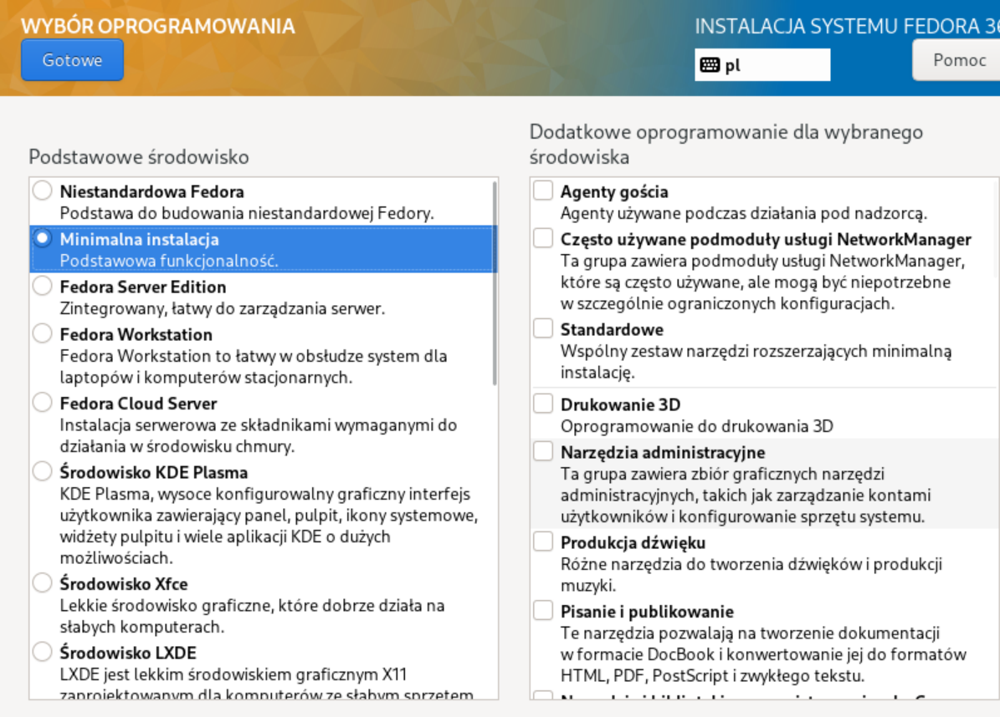
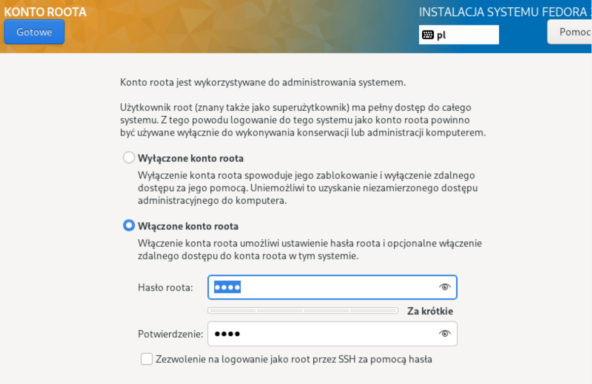
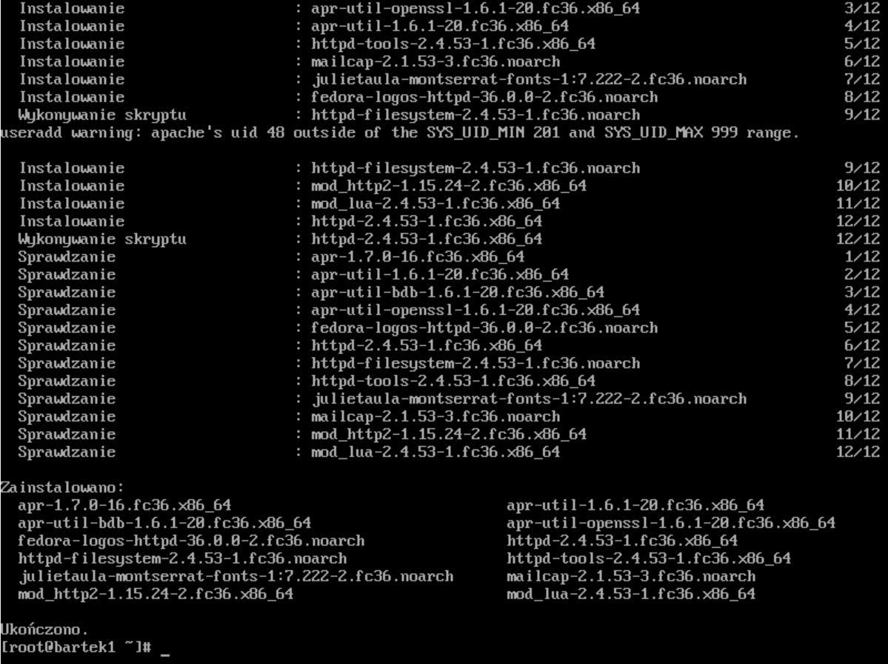
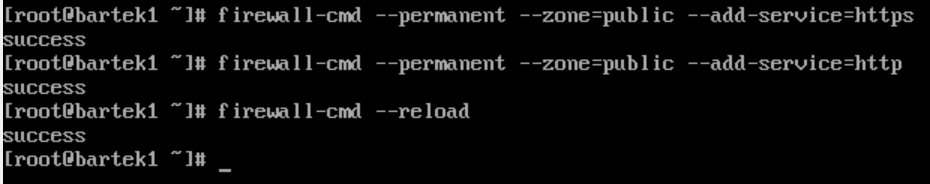
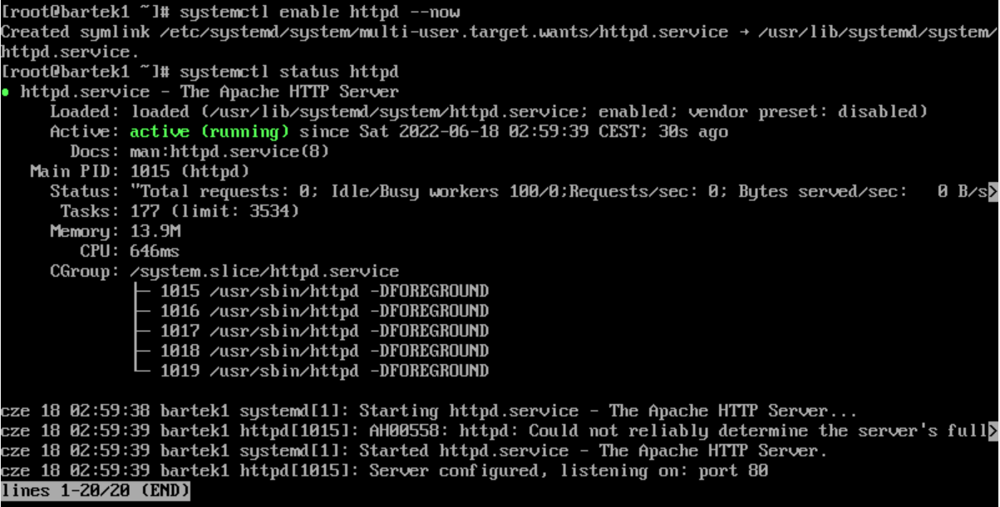

# Sprawozdanie - lab 9 - Bartłomiej Walasek
1. Zainstalowano minimalną wersję systemu Fedora.<br>

2. Utworzono root'a z prostym hasłem.<br>

3. Zainstalowano usługę httpd poleceniem ```sudo dnf -y install httpd```.<br>

4. Zmieniono ustawienia firewall'a. <br>

5. Za pomocą polecenia ```systemctl enable httpd --now``` uruchomiono, a następnie przez polecenie ```systemctl status httpd``` sprawdzono działanie serwera.<br>

