# Sprawozdanie - lab 11 - Bartłomiej Walasek
1. Zainstalowano minikube wg dokumentacji ```https://minikube.sigs.k8s.io/docs/start/```
Użyte polecenia:
```curl -LO https://storage.googleapis.com/minikube/releases/latest/minikube-linux-amd64```<br>
```sudo install minikube-linux-amd64 /usr/local/bin/minikube```<br>
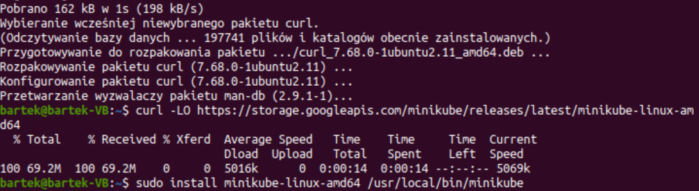<br>
2. Po pierwszym użyciu polecenia ```minikube start``` uzyskano następujący output<br>
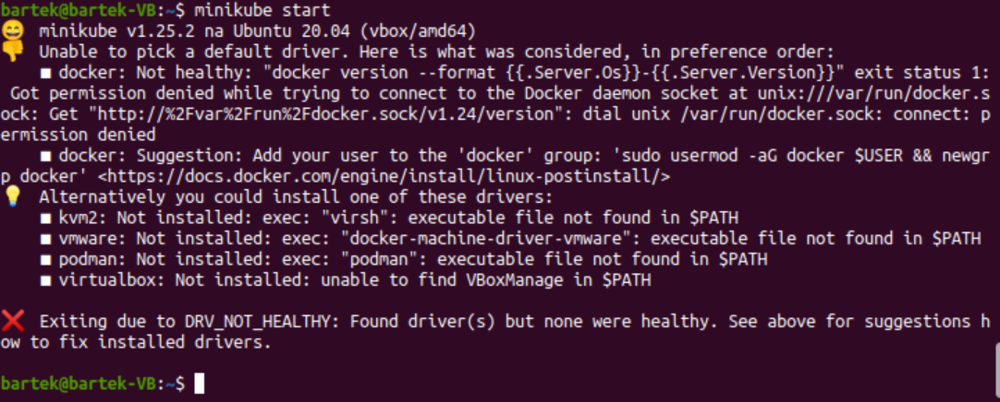
3. Dodano mojego użytkownika do grupy dockerowej i wtedy minikube zaczął działać.<br>
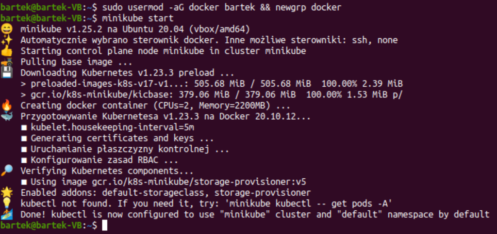
4. Dodano polecenie kubectl używając ```alias kubectl="minikube kubectl --"```<br>

5. Po poprawnej instalacji zostaje uruchomiony Dashboard poleceniem ```minikube dashboard```,
po którym automatycznie uruchamia się przeglądarka<br>
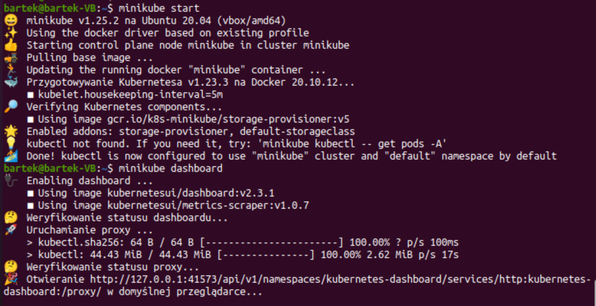
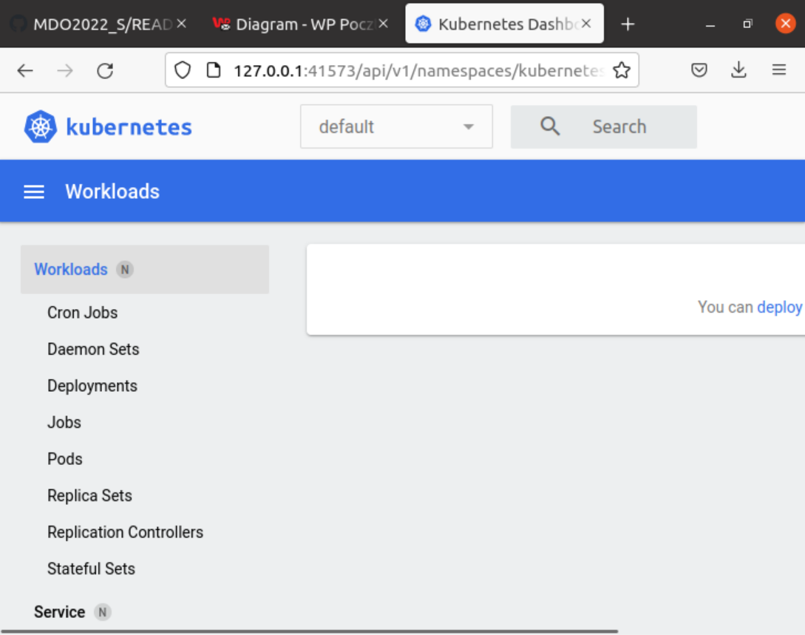
6. Ponieważ używana wcześniej aplikacja, do której zbudowano pipeline, nie wyprowadza portów, 
pobrano aplikację nginx.<br>
Uruchomiono kontener z aplikacją poleceniem ```docker run --name mynginx -p 80:80 -d nginx```<br>
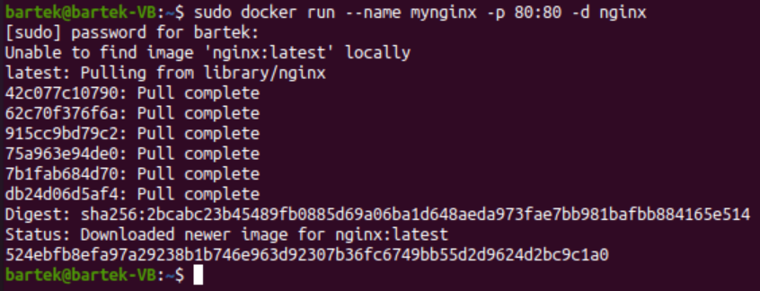
7. Sprawdzono, czy kontenery działają za pomocą polecenia ```sudo docker ps```<br>
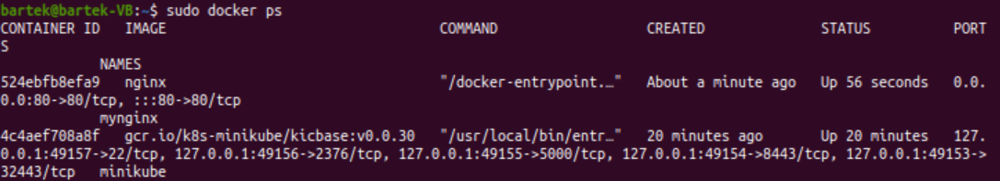
8. Uruchomienie aplikacji na localhost.<br>
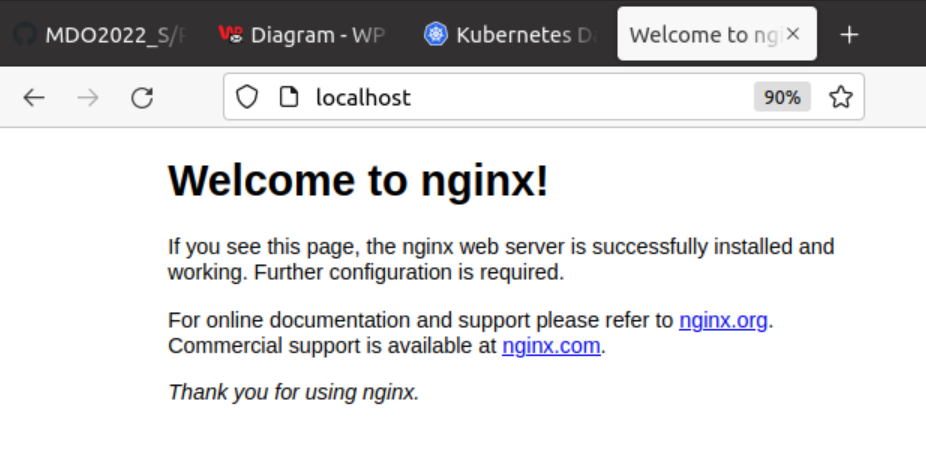
9. Uruchomienie w minikube kontenera zaopatrzonego w poda poleceniem ```minikube kubectl run -- mynginx --image=nginx --port=80 --labels app=mynginx```<br>
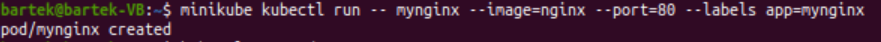
10. Wyprowadzono porty poleceniem ```kubectl port-forward mynginx 2222:80```<br>
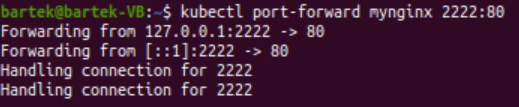
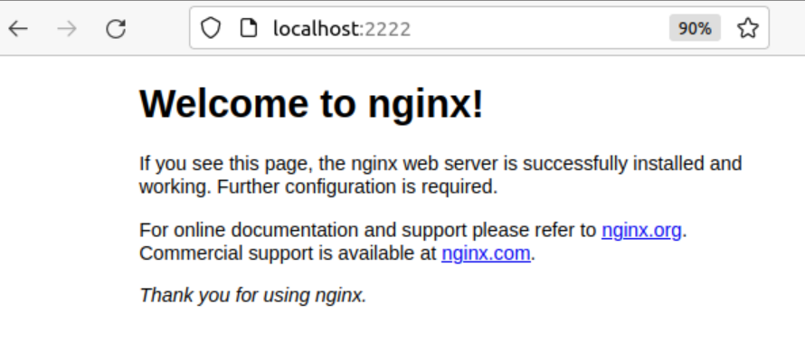
11. Utworzono plik ```deploy.yml```, a w nim skrypt do wdrożenia manualnego<br>
```
apiVersion: apps/v1
kind: Deployment
metadata:
  name: mynginx-deployment
  labels:
    app: mynginx
spec:
  replicas: 3
  selector:
    matchLabels:
      app: mynginx1
  template:
    metadata:
      labels:
        app: mynginx
    spec:
      containers:
      - name: mynginx
        image: nginx
        imagePullPolicy: Never
        ports:
        - containerPort: 2222
```
12. Wprowadzenie zmian wg pliku poleceniem ```kubectl apply-f deploy.yml```<br>
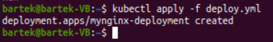
13. W celu sprawdzenia poprawności wdrożenia użyto polecenia ```kubectl get pods -o wide```<br>
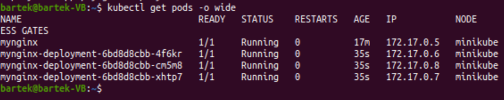
14. Potwierdzenie działania podów w przeglądarce. <br>
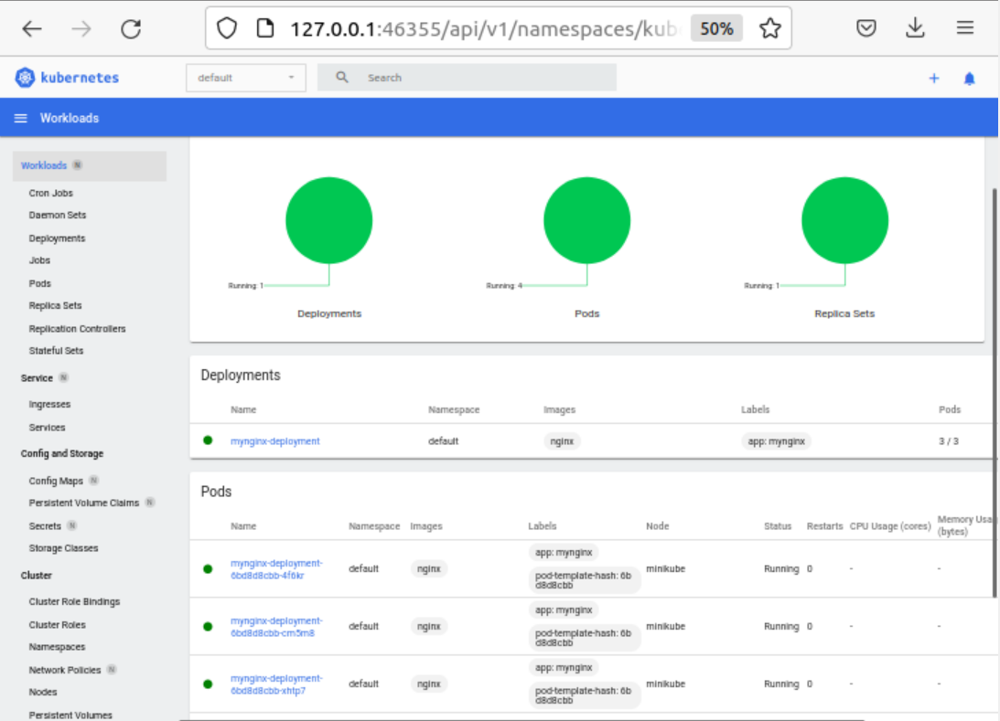
