# Sprawozdanie - lab 12 - Bartłomiej Walasek
1. Zmiana liczby replik w pliku ```deploy.yml``` na 4.<br>
```
apiVersion: apps/v1
kind: Deployment
metadata:
  name: mynginx-deployment
  labels:
    app: mynginx
spec:
  replicas: 4
  selector:
    matchLabels:
      app: mynginx
  template:
    metadata:
      labels:
        app: mynginx
    spec:
      containers:
      - name: mynginx
        image: nginx
        imagePullPolicy: Never
        ports:
        - containerPort: 2222
```
2. Rozpoczęto wdrożenie za pomocą polecenia ```kubectl apply -f deploy.yml```<br>
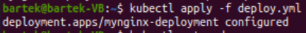
3. Zbadano stan kubectl za pomocą polecenia ```kubectl rollout status -f deploy.yml```<br>
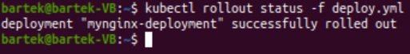
4. Utworzono plik o nazwie "Dockerfile_error", którego uruchomienie kończy się błędem.<br>
```
FROM nginx:latest
CMD [ "exit", "1" ]
```
5. Zbudowano nowy obraz nginx poleceniem ```sudo docker build . -f Dockerfile_error -t mynginx-err```<br>
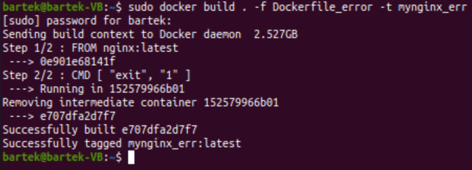<br>
Potwierdzenie utworzenia nowego obrazu<br>
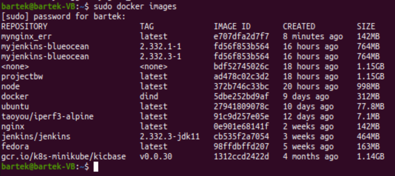
6. Rozszerzono ilość podów do 8, zmieniając w pliku "deploy.yml" wartość ```replicas``` na 8.<br>
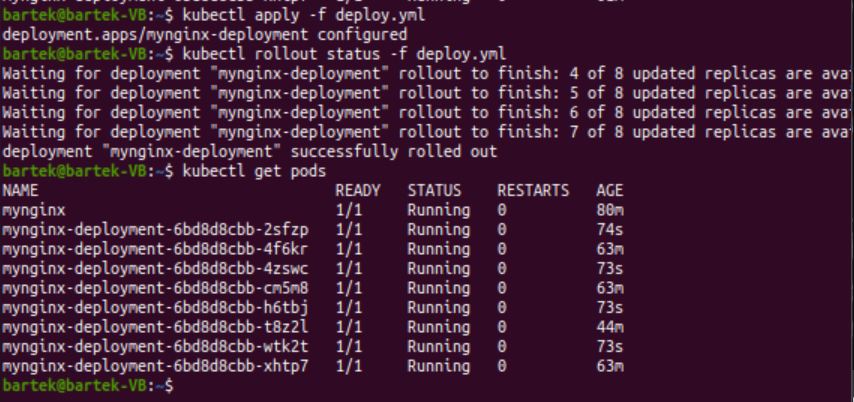
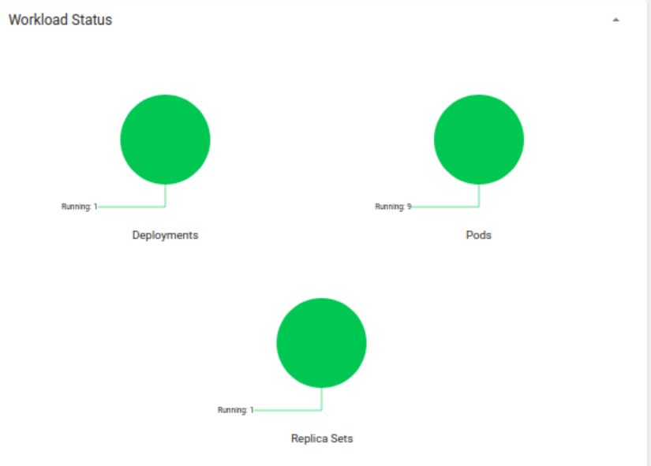
7. Liczbę replik zmniejszono kolejno do 1 i do 0.<br>
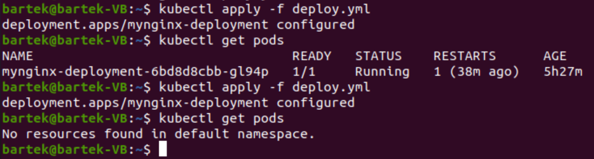	
8. Wyświetlenie wdrożenia z działającym obrazem.<br>
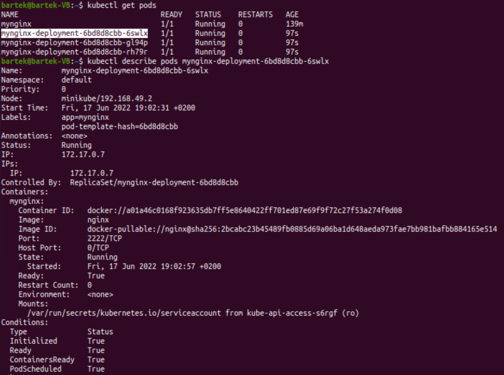
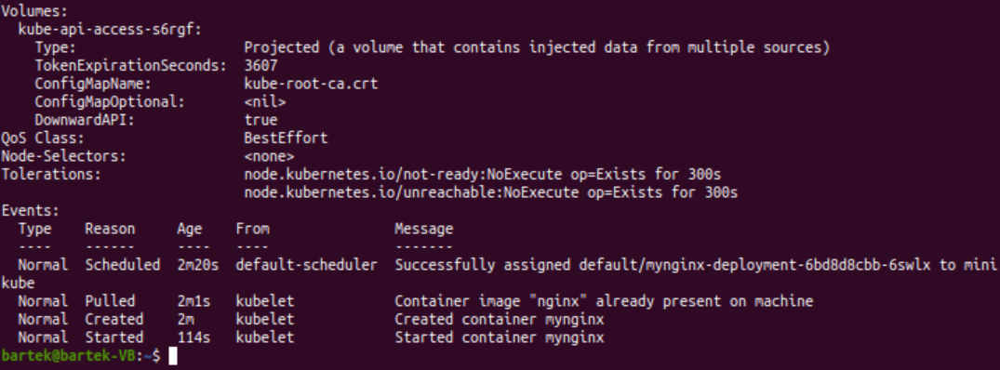
9. Wyświetlenie wdrożenia błędnego obrazu. Wdrożenie utworzono przez zmianę wartości "image" w pliku "deploy.yml" na ```mynginx-err```.<br>
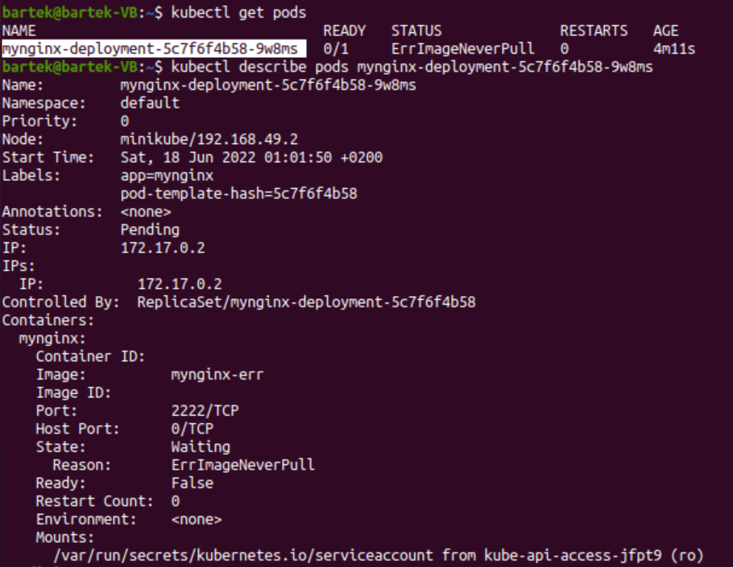
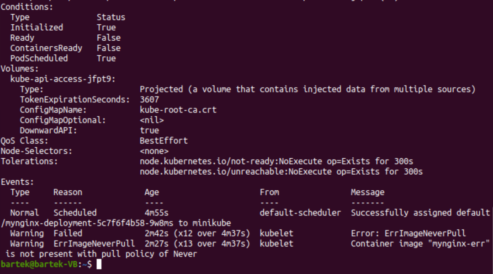
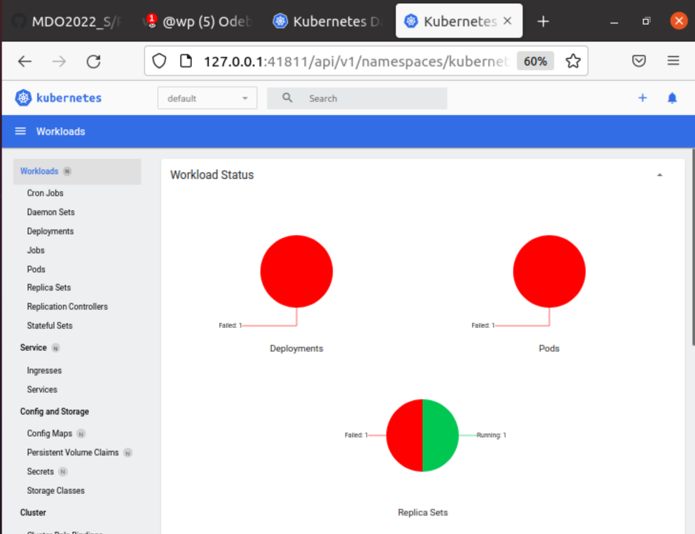
10. Wyświetlono historię zmian poleceniem ```kubectl rollout history deployment mynginx-deployment```.<br>
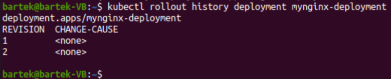
11. Przywrócono poprzednie wersje wdrożeń za pomocą ```kubectl undo deployment mynginx-deployment```<br>
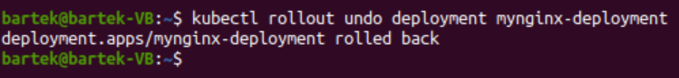
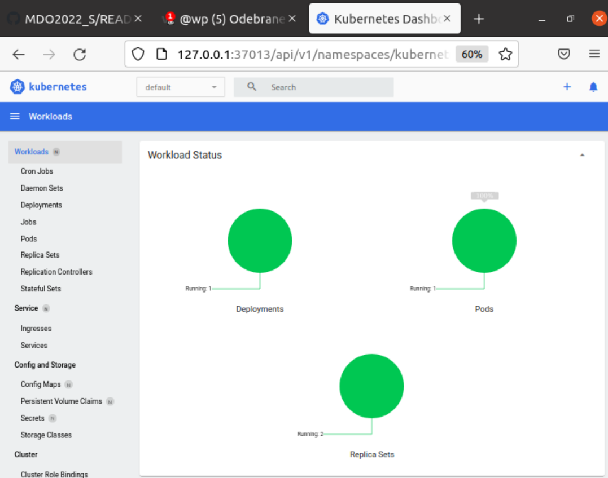
