# Instalacja minikube

- Pobrano oraz zainstalowano minikube
    `curl -LO https://storage.googleapis.com/minikube/releases/latest/minikube-linux-amd64`
    `sudo install minikube-linux-amd64 /usr/local/bin/minikube`

    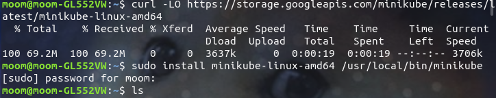
    
- za pomocą komendy `minikube start` włączono minikube
    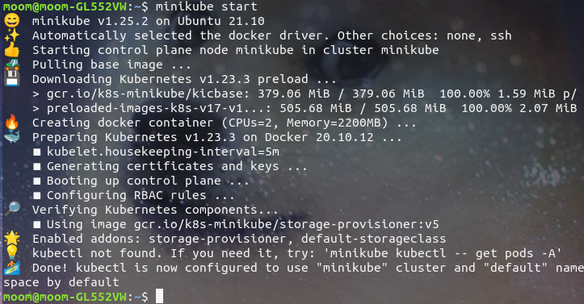

- Sprawdzono działanie minikube
    `minikube kubectl -- get po -A`
    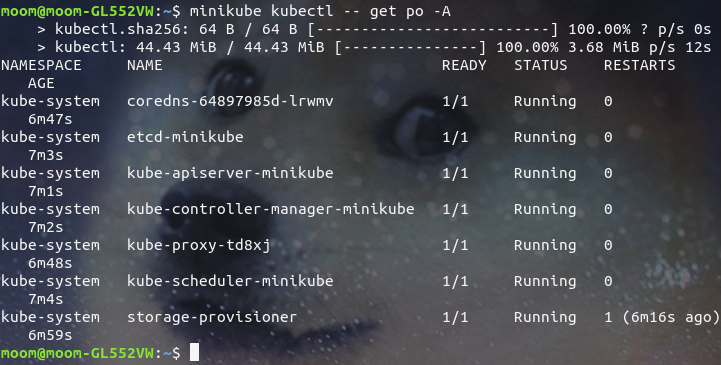

- Do pliku .bashrc dodano linię `alias kubectl="minikube kubectl--"`
    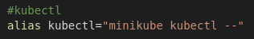

- Sprawdzono działanie
    

- Po długich poszukiwaniach i myśleniu okazało się że linię należy wspisać w terminalu xd
    
    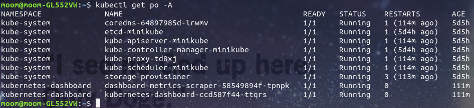

- Za pomocą komendy `minikube dashoard` uruchomiono dashboard
    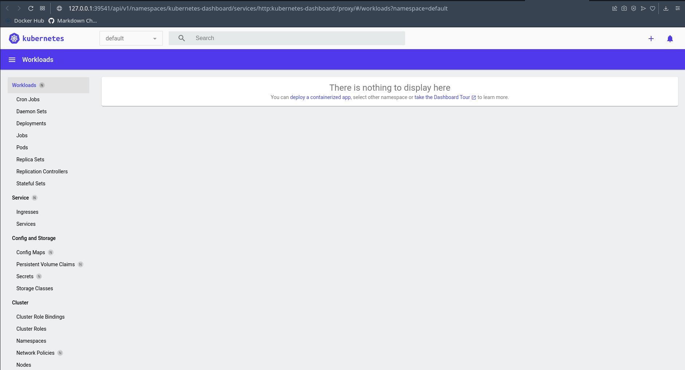

# Analiza posiadanego kontenera

Jako że deploy'owany przeze mnie program nie nadaje się do tego zadania (nie korzysta z żadnych portów), wykorystano gotowy obraz mysql

# Uruchomienie oprogramowania

- Uruchumiono kontener (w minikube) z odpowiednimi parametrami które określaja dostęp do bazy danych
    `kubectl run mysql-devops --image=mysql:5.6 --port 3306 --labels app=mysql_devops --env="MYSQL_ROOT_PASSWORD=password"`
    

- Za pomocą komendy `kubectl get pods` sprawdzono poprawność wykonanego wyżej punktu
    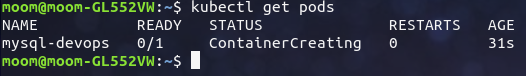

- Sprawdzono zmiany w dashboardzie
    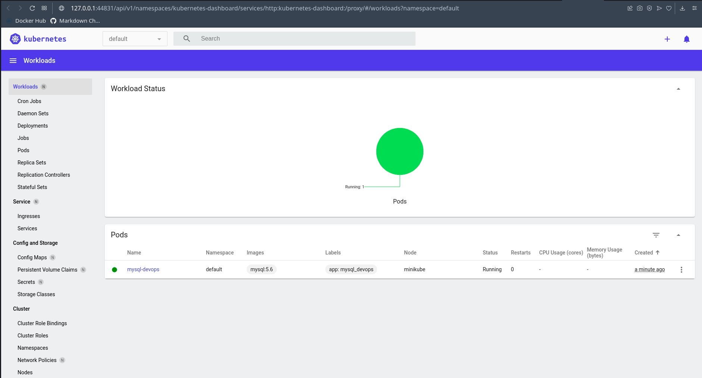

- Za pomocą komendy `kubectl port-forward mysql-devops 3000:3306` podłączono do kontenera port
    

- Uruchomiono mysql w minikube 
    `kubectl exec --stdin -tt pod/mysql-devops -- /bin/bash`
    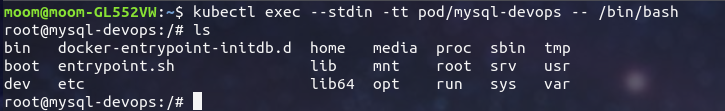
    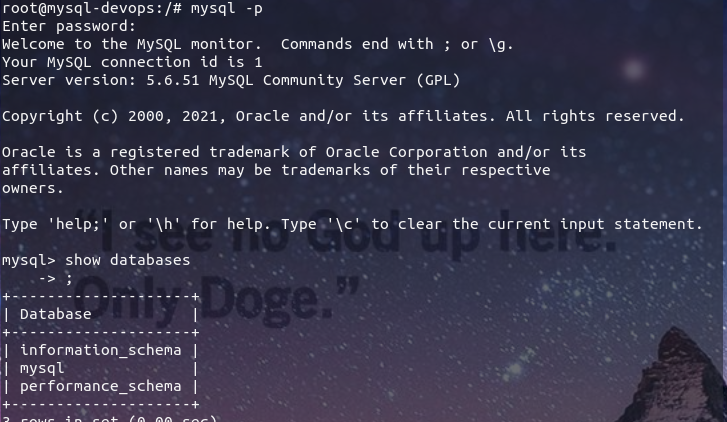

- Utworzono bazę danych
    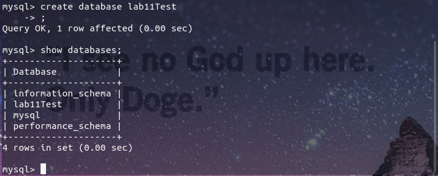

- zainstalowano program DBeaver

- Za pomocą DBeaver połączono się z utworzoną bazą danych
    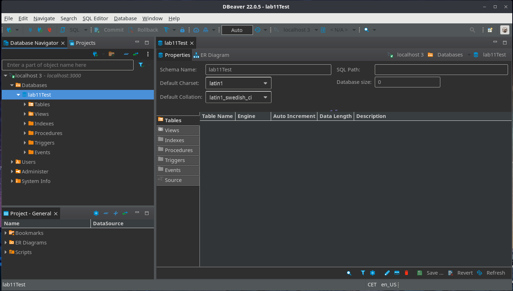
    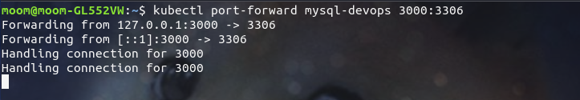

# Przekucie wdrożenia manualnego w plik wdrożenia

- Utworzono plik deploy.yml o zawartości:
```
apiVersion: apps/v1 
kind: Deployment
metadata:
  name: mysql
spec:
  replicas: 3
  selector:
    matchLabels:
      app: mysql
  template:
    metadata:
      labels:
        app: mysql
    spec:
      containers:
      - image: mysql:5.6
        name: mysql
        env:
        - name: MYSQL_ROOT_PASSWORD
          value: password
        ports:
        - containerPort: 3306
          name: mysql
```
    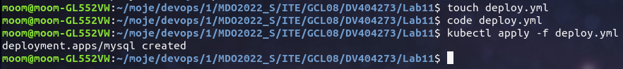

- wdrożono poda za pomocą komendy `kubectl apply -f deploy.yml`
    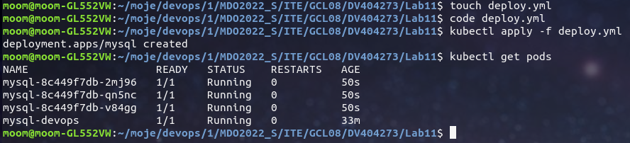
    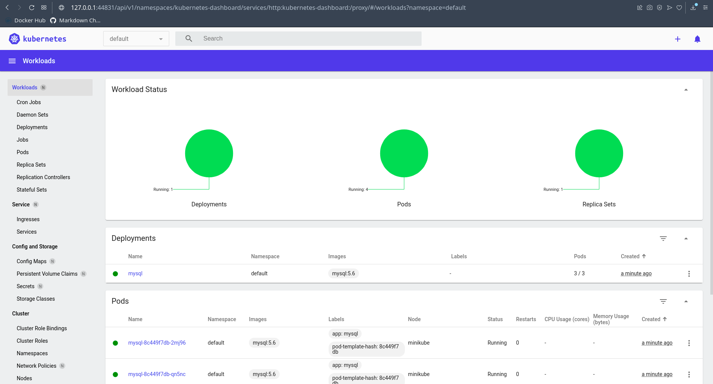
