# Konwersja wdrożenia ręcznego na wdrożenie deklaratywne YAML

- Zwiększono ilość replik o 4

- rozpoczęto wdrożenie za pomocą komendy `kubectl apply -f deploy.yml`
    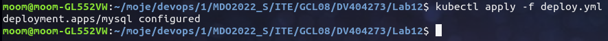

- Zbadano stan za pomocą komendy `kubectl rollout status -f deploy.yml`
    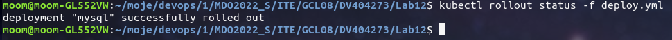

# Przygotowanie nowego obrazu

- utworzono Dockerfile o treści
```
FROM mysql:5.6
ENV MYSQL_ROOT_PASSWORD=password
```

- utworzono nowy obraz za pomocą dockerfile'a
    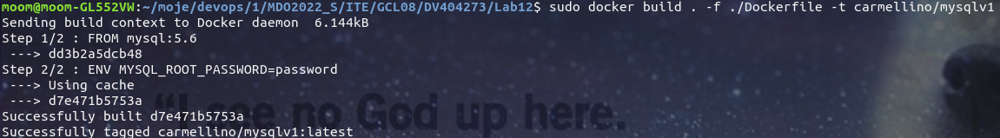

- Zbudowany obraz dodano do dockerhube'a
    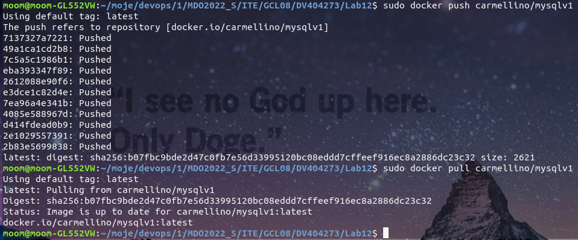

- utworzono Dockerfile o treści
```
FROM mysql:5.6
ENV MYSQL_ROOT_PASSWORD=password
CMD ["exit", "1"]
```

- utworzono nowy obraz za pomocą dockerfile'a
    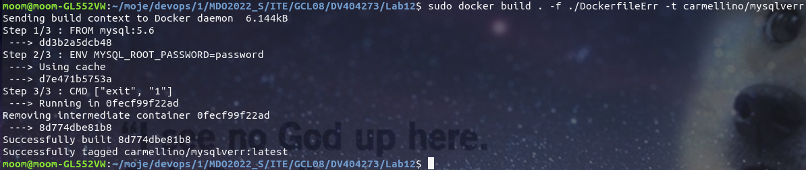

- Zbudowany obraz również dodano do dockerhube'a

# Zmiany w deploymencie

- Zwiększono ilość replik o 4
```
spec:
    replicas: 7
```
    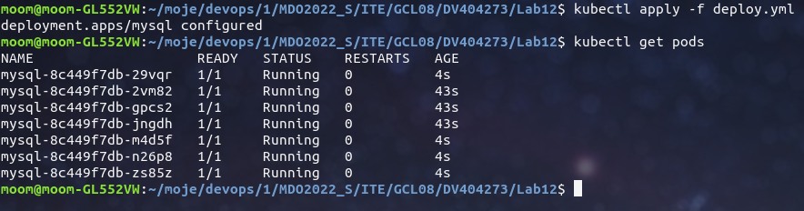

- Zmniejszono ilość replik do 1
```
spec:
    replicas: 1
```
    

- Zmniejszono ilosć replik do 0
```
spec:
    replicas: 0
```
    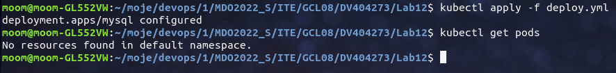

- Zastosowano nową wersję obrazu
    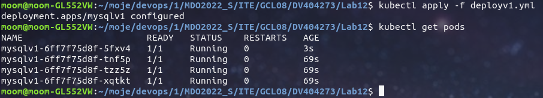

- Zastosowano wersję obrazu zwracającą błąd
    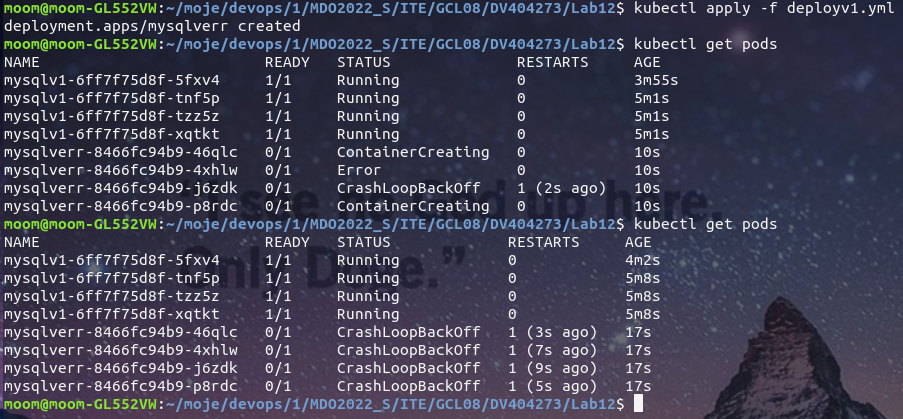

- Spróbowano przywrócić starszą wersję obrazu za pomocą komend
```
kubectl rollout history
kubectl rollout undo
```
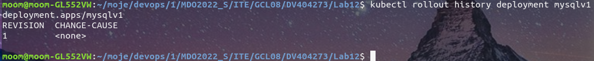

niestety przez to że w poprzednich krokach występowały różne błędy których naprawienie wymagało częstego tworzenia i usuwania deploymentów i podów, starsza wersja nie została zachowana w historii.
Przywrócono ją więc przy użyciu pliku deploy.yml z poprzednich zajęć.

# Kontrola wdrożenia

- napisano skrypt liczący ile sekund zajmuje przeprowadzenie wdrożenia 

```
#!/bin/bash
start=$SECONDS
current=$(minikube kubectl -- get deployment mysql | tail -n+2 | awk '{print $2}' | cut -d "/" -f1)
desired=$(minikube kubectl -- get deployment mysql | tail -n+2 | awk '{print $2}' | cut -d "/" -f2)

while [ "$current" != "$desired" ]
do
    current=$(minikube kubectl -- get deployment mysql | tail -n+2 | awk '{print $2}' | cut -d "/" -f1)
    desired=$(minikube kubectl -- get deployment mysql | tail -n+2 | awk '{print $2}' | cut -d "/" -f2)
done
duration=$(( SECONDS - start ))
echo "done in: $duration"
```

- Uruchomiono napisany skrypt przy uruchomieniu wdrożenia
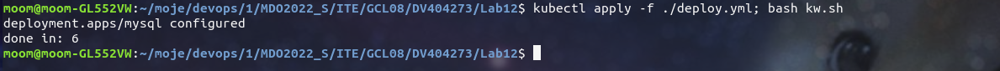

# Strategie wdrożenia

- Przygotowano wersję wdrożenia stosującą Recreate
```
spec:
  strategy: Recreate
```
    Zastosowana strategia sprawia że Wszystkie pody są usuwane jednocześnie oraz jednocześnie wstają.

- Przygotowano wersję wdrożenia stosującą Rolling Update
```
spec:
  strategy: RollingUpdate
```
Zastosowana strategia sprawia że Pody są usuwane pojedynczo lub w zdeklarowanych grupach. Dzięki temu użytkownik ma cały czas dostęp do usług.

- Przygotowano wersję wdrożenia stosującą Canary Deployment workload
```
spec:
  strategy: CanaryDeploymentWorkload
```
Zastosowana strategia sprawia że tworzone jest nowe wdrożenie z podami o zmienionych labelach. Gdy wdrożenie się powiedzie, zmienianey jest label selector w serwisie. W wyniku tego traffic jest routowany na nowe pody bez prawie żadnego downtime'u.

