# sprawozdanie Kubernates Gabriela Urbańczyk

* pierwszym krokiem była instalacja kubernatesa 

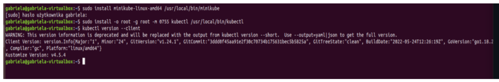
* następnie uruchomienie minikube za pomocą minikube start
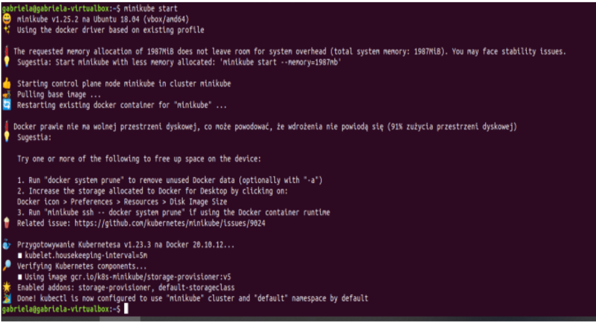
* pokazanie działających nodow oraz podow
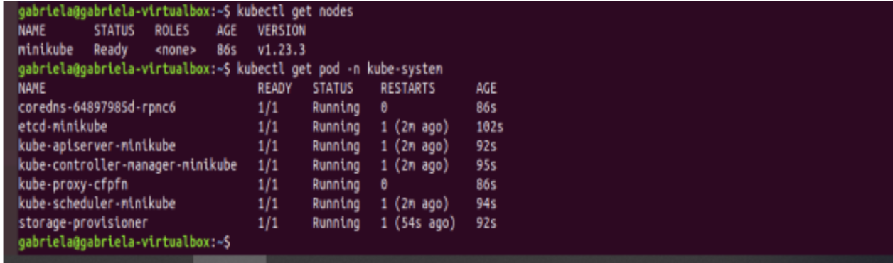
* uruchomienie dashboarda
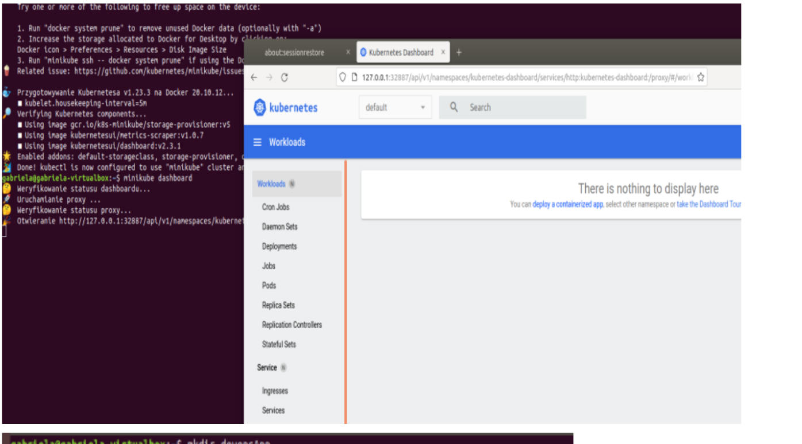
* wymagania sprzetowe

co do wymagan sprzetowych to wlasnie sprawilo mi najwiekszy problem, myslalam ze moj komuter udzwignie to, ale tak jak  z poprzednimi sprawozdaniami mialam problem wlasnie przez komputer tak i teraz. najwiekszym problemmem było to jak wlączałam dashboarda to potrafiłam mieć na linuxie godzinę 15:41 a na windowsie 15:45, takiego typu były lagi po każdym kliknięciu w cokolwiek zmieniu karty itd
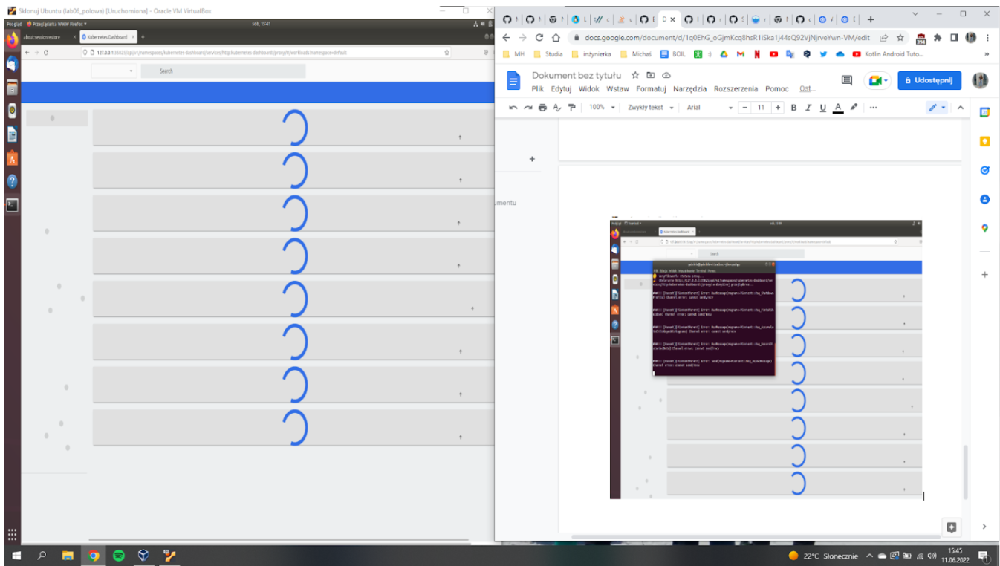

* utworzenie katalogu oraz sklonowanie do niego aplikacji
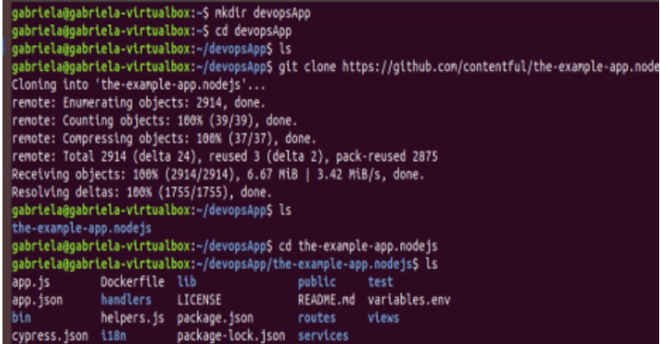

* build aplikacji za pomoca dockerfile oraz wystartowanie go na localhost
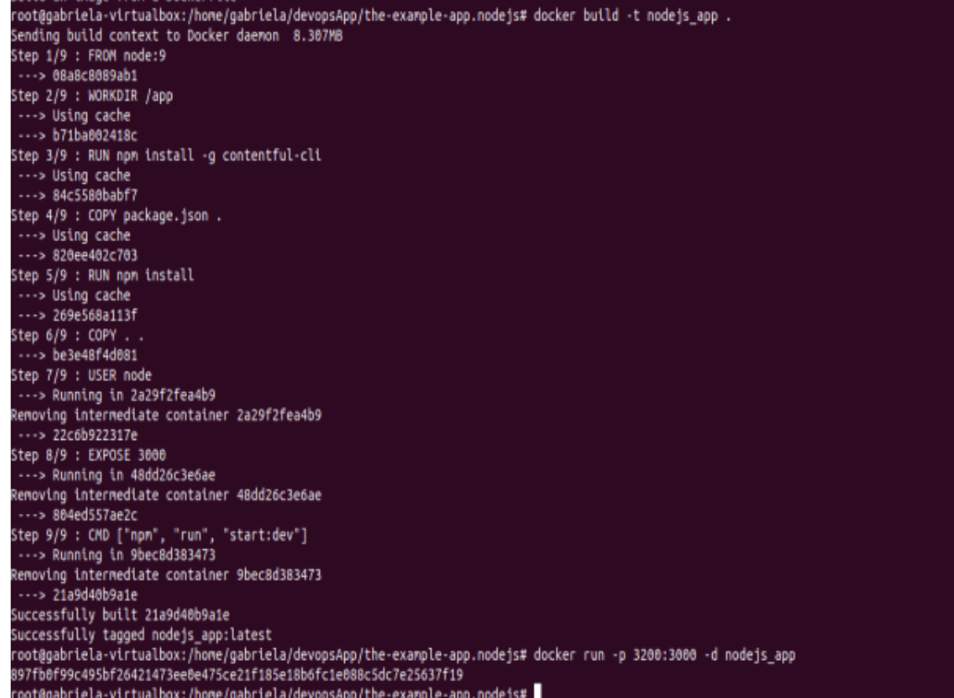
* działanie na localhost 
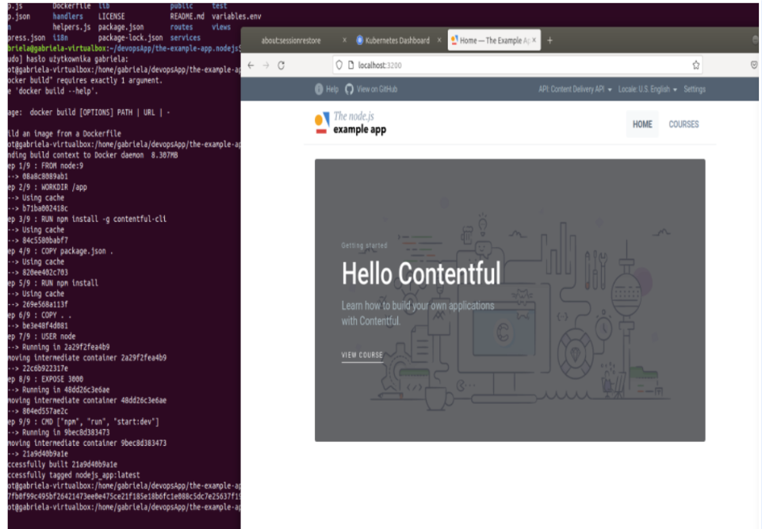
* utworzenie pliku definicja dla aplikacji
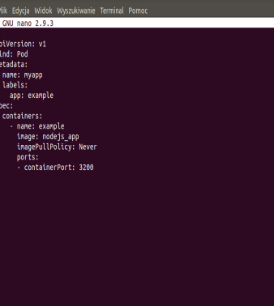

* następnym krokiem był apply poda i przy tym niestety miałam problem ponieważ eval niby działał ale wciąż na deshboardzie miałam errory, próbowałam zmieniać dostępy za pomocą chmoda, wielokrotne budowane aplikacji, ale wciąż to nic nie dawało a z racji że dziś jest dzień oddania to wolę oddać w takiej formie, zarówno problemy sprzętowwe jak również ten błąd sprawił że nie mogłam kontynuować dalszej części zadania 

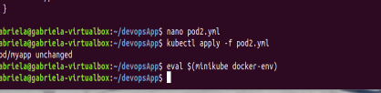
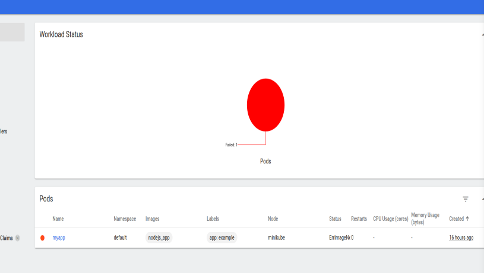