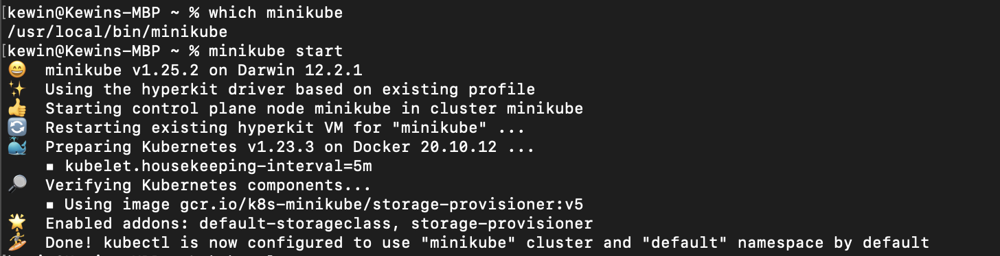
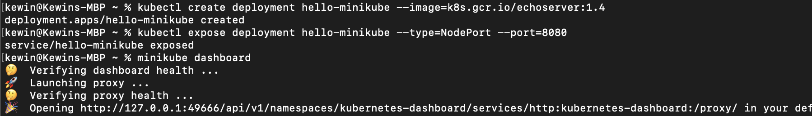
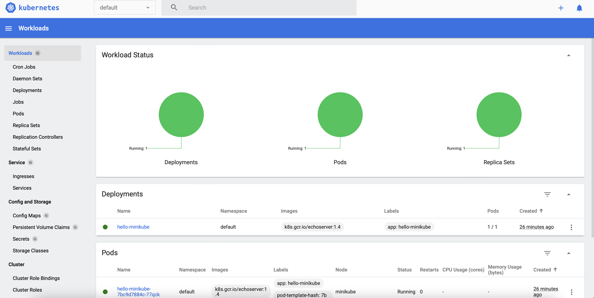
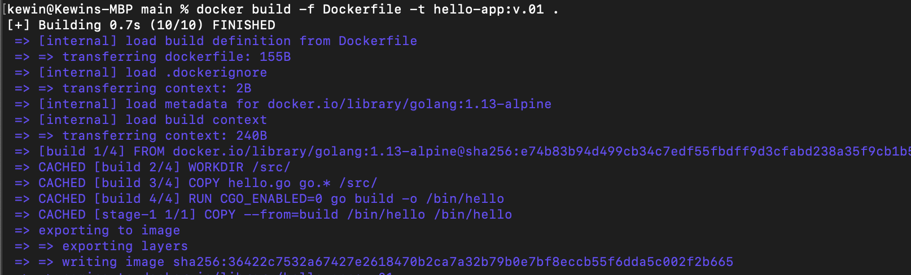
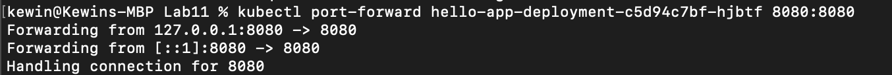
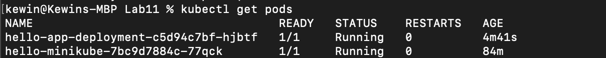
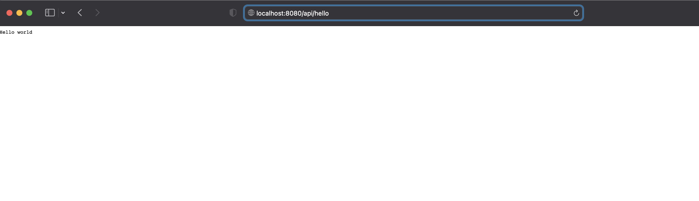
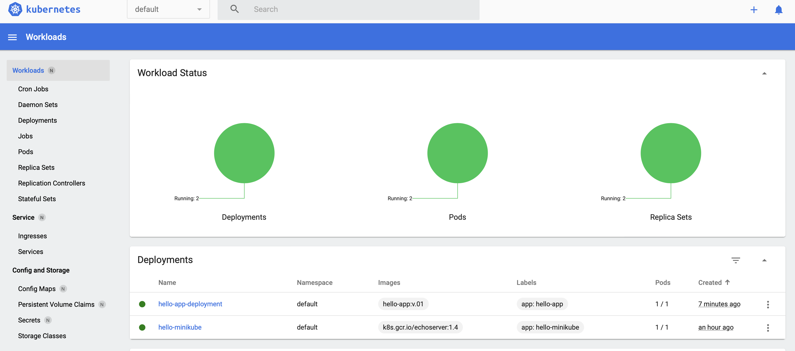

Kewin Tarnowski,
Informatyka Techniczna,
Gr. 8, nr albumu: 401975

Metodyki DevOps
Lab 11

# Przebieg ćwiczenia

- Minikube został zainstalowany wcześniej, uruchomienie:

- Przykładowe wdrożenie obrazu hello-minikube:

- Dashboard:

- Stworzono prostą aplikację wypisującą "hello world" działającą na porcie, a do niej Dockerfile w folderze /main. Następnie zbudowano obraz z Dockerfile:

- Stworzono deployment controller:

- Przekierowano port:

- get pods:

- Jak widać, aplikacja uruchamia się na wskazanym porcie:

- Dashboard:

