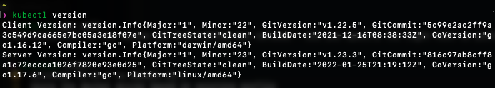
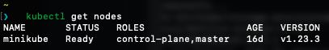
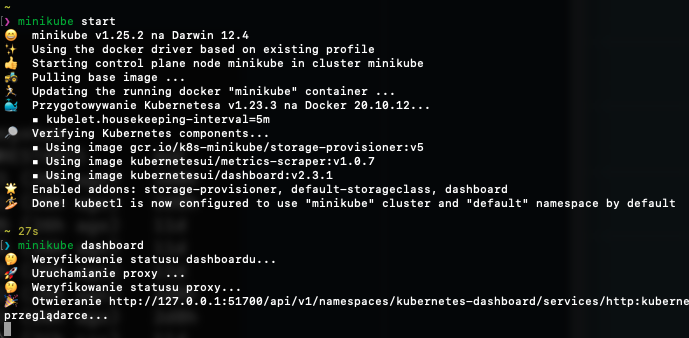
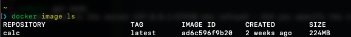
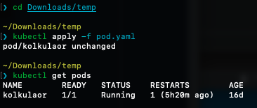
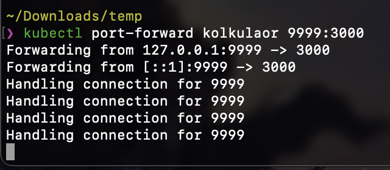
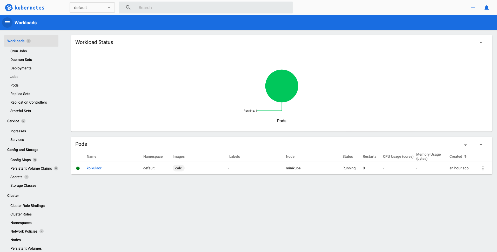
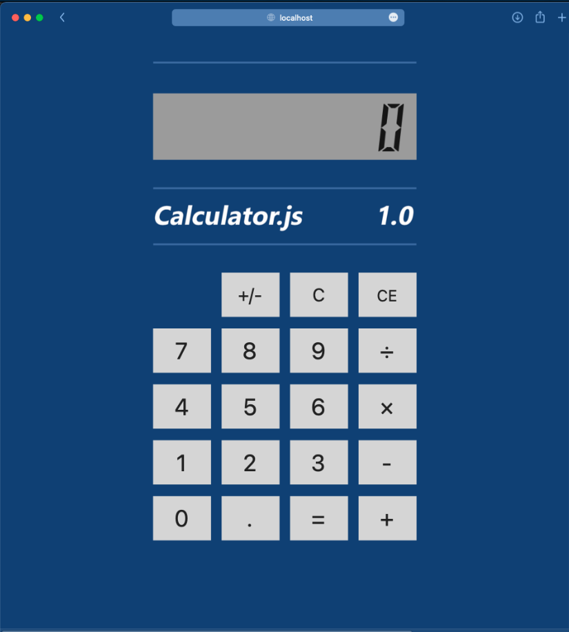

# Lab11 - Krystian Zapart

### Zainstalowany kubectl

### Nody minikuba 

### Dashboard minikube'a

### Dockerfile aplikacji Calculator

```
FROM node:10

WORKDIR /usr/src/app

COPY package*.json ./

RUN npm ci --only=production
COPY . .

EXPOSE 3000
CMD [ "npm", "start" ]
```

### Uruchamianie aplikacji w kontenerze 


### Utworzenie Poda

```
apiVersion: v1
kind: Pod
metadata:
  name: kolkulaor
spec:
  containers:
  - name: calc
    image: calc
    imagePullPolicy: Never
    ports:
    - containerPort: 3000
    command: ["/bin/bash","-c","cd calculator && npm start"]

```


### Port-forward pod'a

### Uruchomiona aplikacja


