## Lab 12

### Ustawienie ilości replik w deploymencie 
```
apiVersion: apps/v1
kind: Deployment
metadata:
  name: calculator
  labels:
    app: calculator
spec:
  replicas: 4
  selector:
    matchLabels:
      app: calculator
  template:
    metadata:
      labels:
        app: calculator
    spec:
      containers:
      - name: calculator
        image: calc
        imagePullPolicy: Never
        ports:
        - containerPort: 3000
```
#### Status podów i deploymentu 
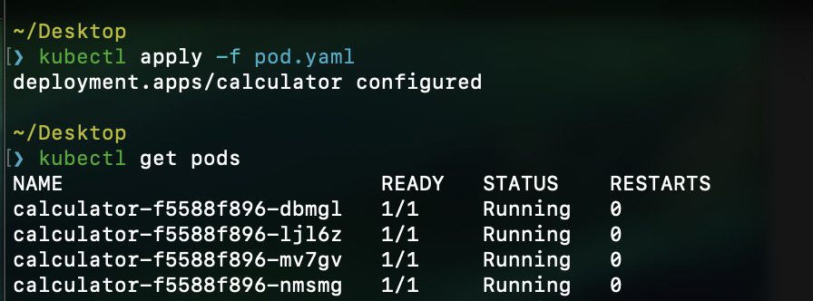

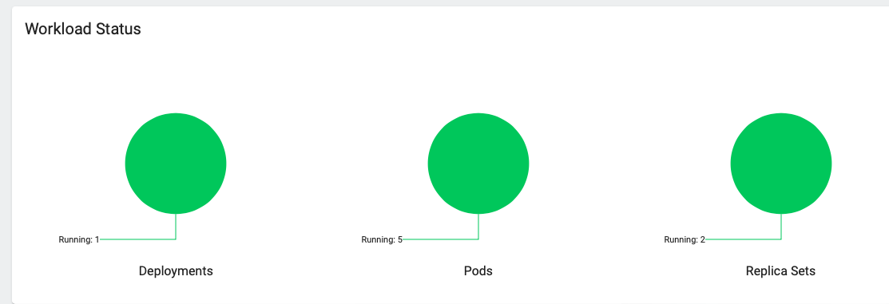

### Utworzenie nowych wersji obrazów 

wersja z env 2
```
FROM node:alpine

WORKDIR /usr/src/app

COPY package*.json ./

RUN npm ci --only=production
COPY . .

ENV version=2

EXPOSE 3000
CMD [ "npm", "start" ]

```
wersja exit 
```
FROM node:alpine

WORKDIR /usr/src/app

COPY package*.json ./

RUN npm ci --only=production
COPY . .

ENV version=2

EXPOSE 3000
CMD [ "npm", "1" ]

```

utworzone obrazy 

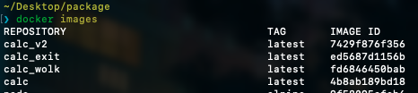

### Zmiany w deploy 

#### ilość replik: 8
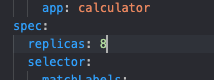

#### status 
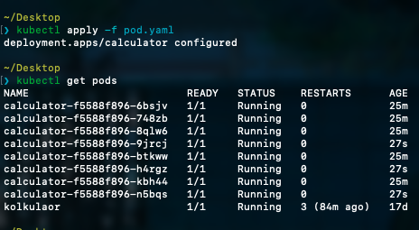

#### ilość replik: 1
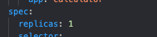

#### status 
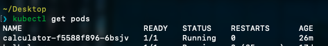

#### ilość replik: 0 
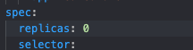

#### status 


#### Nowy obraz:
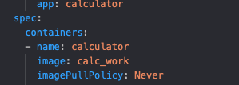

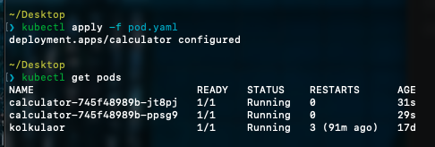

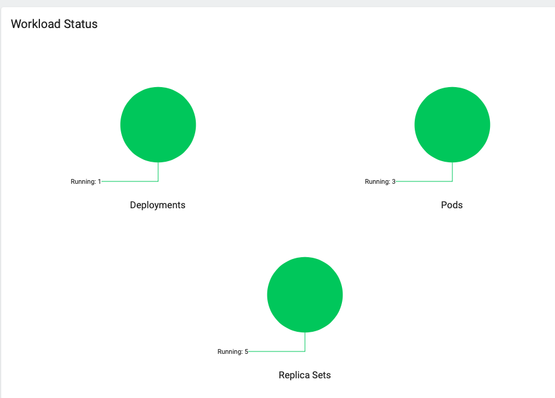

#### Obraz wersja Exit 
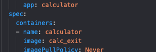

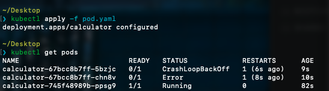

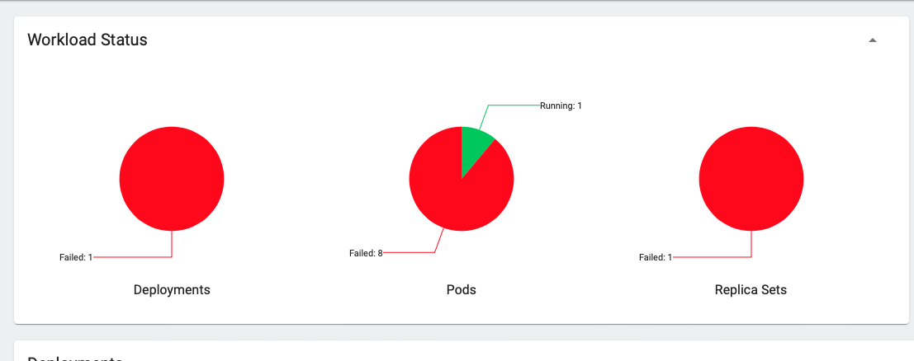

#### Przywracanie wersji 
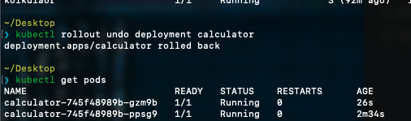

### Kontrola wdrożenia

Napisano skrypt porównujący output polecenia "kubectl get deployment ..."
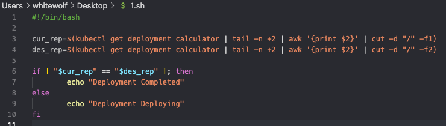

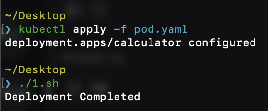
### Strategie wdrożenia 

Recreate pozwala na jednoczesne usunięcie i odtworzenie wszytkich podów

Rolling update pojedyńczo usuwa powstałe pody
