# **Michał Zając - Sprawozdanie z DevOps lab11**

## **Cel laboratoriów:**
 Celem tych laboratoriów było wdrożenie na zarządzalne kontenery: **Kubernetes**


 ---
## **Instalacja klastra Kubernetes**

Instalacja minikube została wykonana poprzez wykonywanie poleceń zawartych w dokumentacji minikube. Dostępna jest ona na stronie: https://minikube.sigs.k8s.io/docs/start/


> Jeśli nie mamy na swojej maszynie wirtualnej `curl`, należy go zainstalować za pomocą polecenia `sudo apt install curl`:  
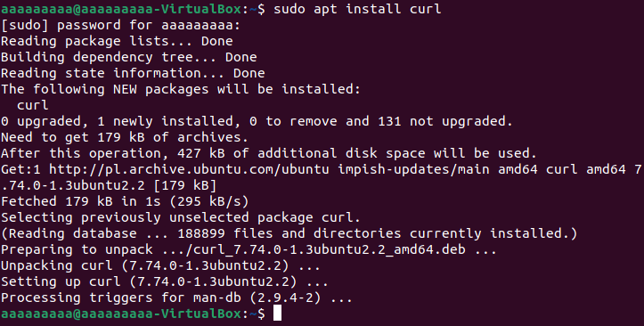

Korzystając z polecenia `curl -LO https://storage.googleapis.com/minikube/releases/latest/minikube-linux-amd64` pobieramy minikube. Gdy minikube zostanie już pobrany, należy go zainstalować za pomocą komendy: `sudo install minikube-linux-amd64 /usr/loca/bin/minikube`

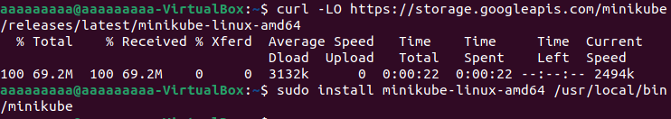

Następnie należy zainstalować pakiet `kubectl`. Pakiet ten pozwala korzystać z komend do zarządzania klastrami Kubernetes'owymi z poziomu command-line'a. W celu instalacji wykorzystano dokumentację pakietu **kubectl** znajdującą się na stronie: https://kubernetes.io/docs/tasks/tools/install-kubectl-linux/.  
W celu pobrania najnowszej wersji pakietu, należy skorzystać z następującej komendy: `curl -LO "https://dl.k8s.io/release/$(curl -L -s https://dl.k8s.io/release/stable.txt)/bin/linux/amd64/kubectl"`. Po pobraniu najnowszej wersji warto sprawdzić jej sumę kontrolną, w celu upewnienia się czy została pobrana poprawna wersja. W tym celu pobieramy najpierw plik zawierający sumę kontrolną kubectl za pomocą komendy: `curl -LO "https://dl.k8s.io/$(curl -L -s https://dl.k8s.io/release/stable.txt)/bin/linux/amd64/kubectl.sha256"`, po czym sprawdzamy ją wykorzystując komendę: `echo "$(cat kubectl.sha256)  kubectl" | sha256sum --check`. Jeśli wynik będzie równy `kubectl: OK` będzie to oznaczać, iż wykonaliśmy wszystko poprawnie i możemy przystąpić do instalacji.

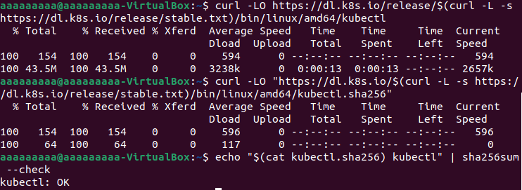

Instalację pakietu `kubectl` wykonujemy za pomocą komendy `sudo install -o root -g root -m 0755 kubectl /usr/local/bin/kubectl`. Po zainstalowaniu tego pakietu sprawdzamy, czy zainstalowna wersja jest najnowszą wersją... dokonać tego można poprzez komendę `kubectl version --client --output=yaml`.

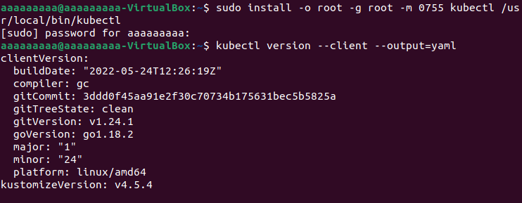

Następnie przechodzimy do uruchomienia minikube. Dokonać tego możemy poprzez wykonanie komendy `minikube start`. Pod spodem zrzut ekranu dokumentujący błąd przy uruchamianiu minikube'a:

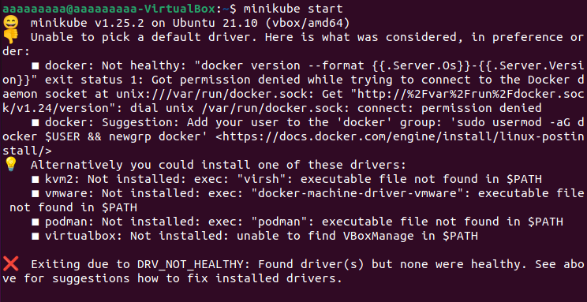

Na szczęście rozwiązanie tego problemu widnieje praktycznie przed nami. Błąd ten możemy naprawić poprzez dodanie użytkownika do grupy *docker*. Należy to zrobić poprzez wykonanie komendy `sudo usermod -aG docker $USER && newgrp docker`. Pod spodem kolejna próba uruchomienia minikube.

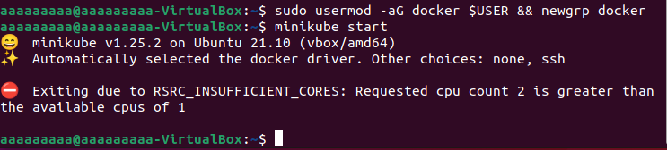

> Minikube należy uruchamiać na maszynie wirtualnej mającej przydzielone conajmniej 2 rdzenie, w przeciwnym wypadku nie zostanie on uruchomiony. Aby zmienić ilość rdzeni należy wejść w ustawienia maszyny wirtualnej (podczas wyłączonej wirtualki), a następnie w zakładce System -> procesor - zmienić ilość przydzielonych rdzenia na więcej niż 1!

Pod spodem jeszcze raz uruchomienie minikube, jednak teraz po przydzieleniu wymaganej ilości rdzeni do wirtualki. Po poprawnej próbie program powinien zacząć pobierać obraz bazowy. Dodatkowo po instalacji możemy zauważyć, że kubectl został automatycznie skonfigurowany aby domyślnie korzystać z klastra minikube:

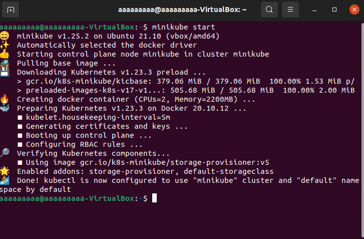


Po instalacji sprawdzamy działające node'y za pomocą komendy `kubectl get nodes` oraz pody za pomocą komendy `kubectl get pod -n kube-system`:
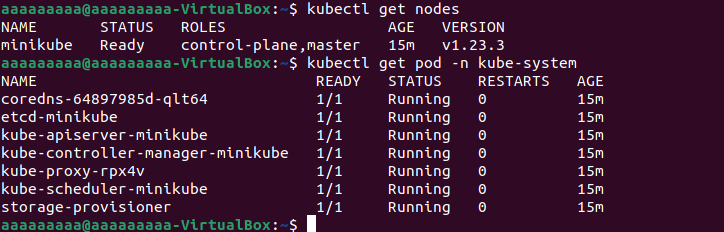

A na sam koniec uruchamiamy dashboard. Jako, iż pomimo wyświetlenia paru błędów, kubernetes uruchomił się poprawnie i bez żadnych zarzutów działał w przeglądarce, błędy po prostu zignoruję (gdyż nie dotyczą one działania kubernetes'a):

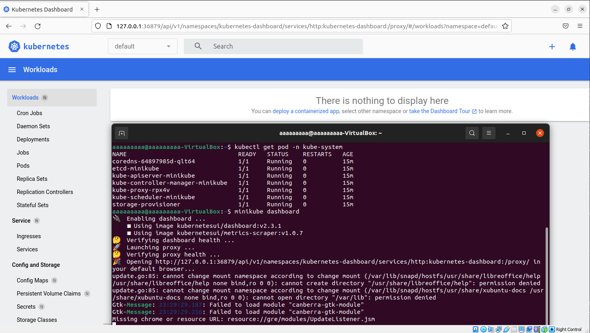

---
## **Analiza posiadanego kontenera**

> Jako, iż aplikacja użyta do poprzednej części laboratoriów (**vscode**) nie wyprowadza żadnego portu, na potrzeby tego laboratorium zmieniłem projekt na **nginx**. W celu instalacji i uruchomienia tej aplikacji posłużono się dokumentacją znajdującą się na stronie: https://hub.docker.com/_/nginx

Na samym początku należy pullnąć aplikację na dockera. Wykorzystujemy do tego komendę `sudo docker pull nginx` (zostanie w tym wypadku pobrana najnowsza wersja).

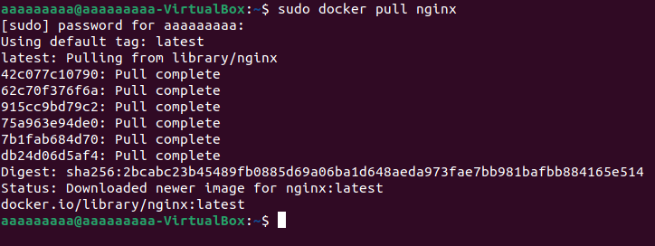

Po pobraniu aplikacji, możemy uruchomić ją z wyprowadzeniem portu **8080**, w tym celu korzystamy z komendy `docker run --name somenginx -d -p 8080:80 nginx`.

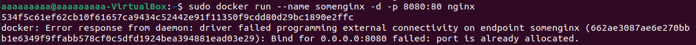

Jak widać, po uruchomieniu komendy zwrócony został błąd "Port jest już w użytku". Aby dowiedzieć się, która aplikacja korzysta z danego portu, wykorzystujemy komendę `sudo lsof -i -P -n` i wyszukujemy w kolumnie **NAME** port **8080**.

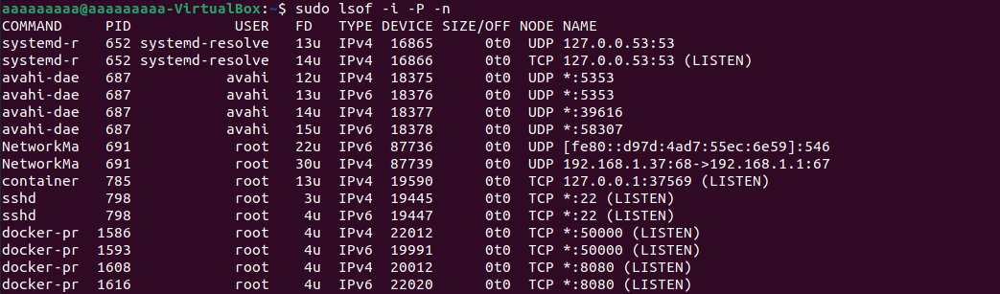

Możemy zauważyć, że port `8080` jest w użytku przez `docker-pr`. Oznacza to, że któryś z aktualnie działających kontenerów w Dockerze wyprowadza port **8080**. Aby dowiedzieć się, który to kontener należy wykorzystać komendę `sudo docker ps`, wyświetli ona aktualnie działające kontenery.

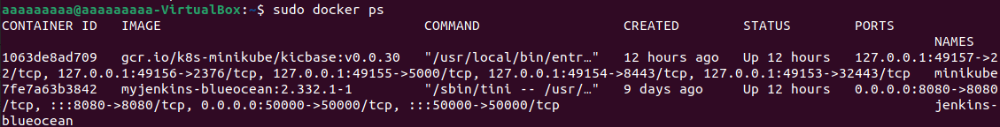

Jak widać, kontener z wcześniejszych laboratoriów `myjenkins-blueocean:2.332.1-1` zawierający Jenkinsa, nadal wyprowadza port 8080. Stopujemy ten kontener za pomocą komendy `sudo docker stop 7fe7a63b3842`, gdzie ciąg znaków oznacza identyfikator kontenera, który ma zostać zatrzymany (można także zamknąć kontener podając jego nazwę). Poniżej poprawne zatrzymanie działania kontenera. 

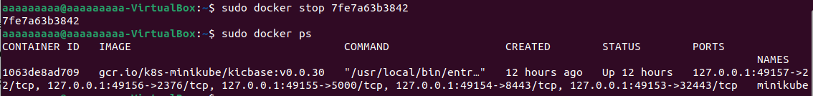

Następnie należy uruchomić kontener z nginx za pomocą wcześniejszej komendy `docker run --name enginx -d -p 8080:80 nginx`.

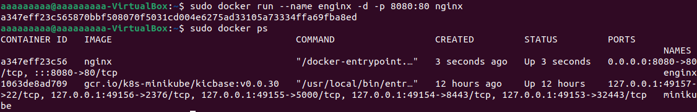

A tutaj udokumentowanie poprawności działania aplikacji, poprzez uruchomienie `https://localhost:8080` w oknie przeglądarki.

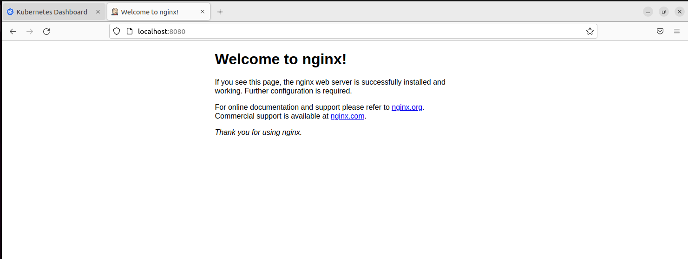

Kolejnym krokiem będzie uruchomenie kontenera `nginx` w minikubie. Wykorzystano do tego komendę `minikube kubectl run -- enginx --image=nginx --port=8080 --labels app=enginx`. Po uruchomieniu go, można także wyświetlić wszystkie pody w celu sprawdzenia poprawności jego dzialania (pody mogą się chwilę tworzyć, dlatego należy cierpliwie czekać).

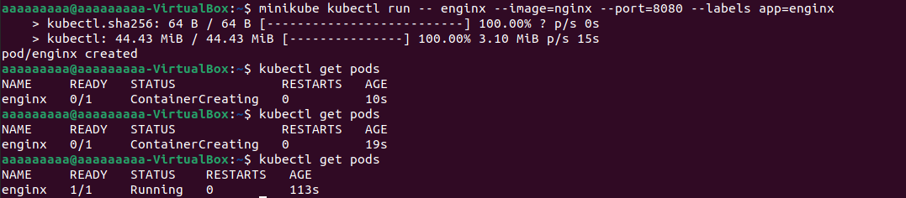

A tutaj wyświetlenie aktualnych podów w dashboardzie Kubernetes'owym:
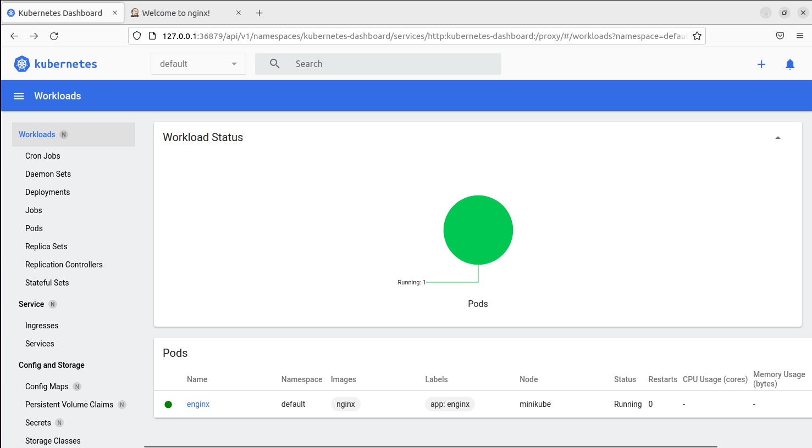

Ostatnią częścią będzie wyprowadzenie portów. Dokonać tego można poleceniem `kubectl port-forward enginx 2222:8080`. Tej części laboratoriów nie udało mi się wykonać. Za każdym razem gdy przekierowywałem dowolny port na port gdzie działał `nginx` - port **8080**, otrzymywałem bład. Próbowałem przeróżnych portów, jednak za każdym razem dostawałem informację *"lost connection to pod"*, dlatego pominę tą część i przejdę do następnej części laboratoriów.

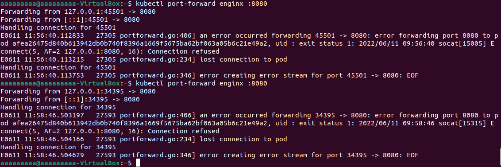

---
## **Przekucie wdrożenia manualnego w plik wdrożenia (wprowadzenie)**

Następującą część można zrobić zarówno w command-line, jak poprzez dashboard Kubernetesowy.

Jeśli robimy ją poprzez cmd, należy najpierw stworzyć plik wdrożenia manualnego `deploy.yaml`, po czym edytować go umieszczając w nim następujący kod:
```
apiVersion: apps/v1
kind: Deployment
metadata:
  name: myapp
  labels:
    app: enginex
spec:
  replicas: 3
  selector:
    matchLabels:
      app: enginex
  template:
    metadata:
      labels:
        app: enginex
    spec:
      containers:
      - name: enginex
        image: nginx
        imagePullPolicy: Never
        ports:
        - containerPort: 2222
```

Następnie za pomocą `kubectl apply -f deploy.yaml` należy zatwierdzić wprowadzone zmiany. Na koniec sprawdzamy czy wszystko przebiegło poprawnie korzystając z komendy `kubectl getpods -o wide`:

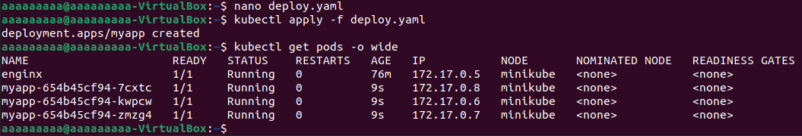  

---
Inną opcją jest stworzenie podów poprzez specyfikację zawartości pliku `.yaml` od strony przeglądarki. W tym celu, wewnątrz dashboarda Kubernetes'owego, wchodzimy w zakładkę **Create new resource** w prawym górnym rogu ekranu. Naszym oczom powinno ukazać się pole tekstowe, w którym możemy wpisać zawartość naszego pliku. Po specyfikacji wszystkich parametrów klikamy na przycisk **Upload**.
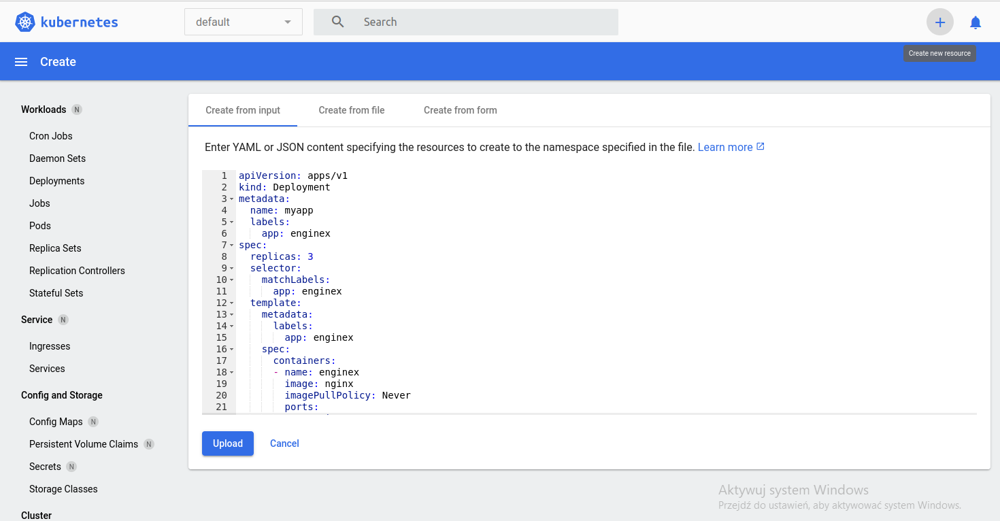

Po kliknięciu tego przycisku zostaną zatwierdzone wszystkie zmiany i naszym dashboardzie powinny ukazać się utworzone pody:


