# **Michał Zając - Sprawozdanie z DevOps Lab12**

## **Cel laboratoriów:**
 Celem tych laboratoriów było wdrażanie na zarządzalne kontenery - **Kubernetes** (część 2)

---
## **Konwersja wdrożenia ręcznego na wdrożenie deklaratywne YAML**

Aby wykonać tą część zadania, musimy edytować plik wdrożenia manualnego, który został stworzony na poprzednich laboratoriach - `deploy.yaml`. Modyfikujemy w nim ilość replik na 4, po czym zapisujemy go i rozpoczynamy wdrożenie za pomocą polecenia `kubectl apply -f deploy.yaml`, a następnie sprawdzamy jego stan za pomocą komendy `kubectl rollout status -f deploy.yaml`. 

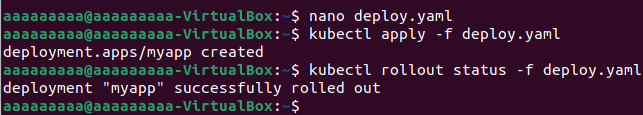

Dodatkowo możemy wyświetlić w dashboardzie Kubernetes'a ilość aktualnie działających podów do naszego deploy'a:
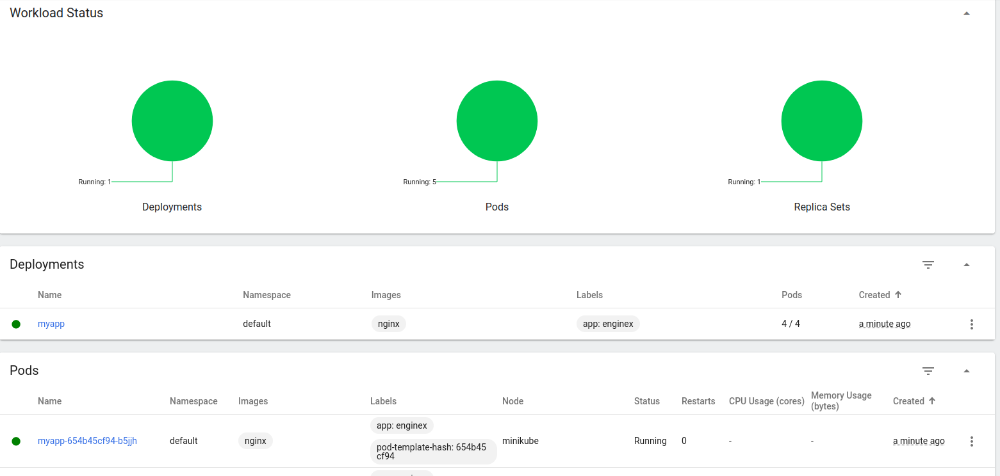

---
## **Przygotowanie nowego obrazu**

Kolejnym krokiem jaki należy wykonać, to zarejestrowanie nowej wersji swojego obrazu w dockerhubie. Wykonane to zostanie poprzez zalogowanie się do dockerhuba z poziomu command-line'a, przy wykorzystaniu danych do logowania, które zostały ustawiane podczas wykonywania **Lab02**. Komenda do zalogowania się do dockerhuba jest następująca: `docker login -u username`. Następnie będziemy musieli stworzyć przynajmniej dwie wersje obrazu z `nginx`. Jedna wersja będzie działać poprawnie, natomiast druga będzie kończyć się błędem przy każdej próbie uruchomienia programu. W tym celu musimy stworzyć katalog z aplikacją.

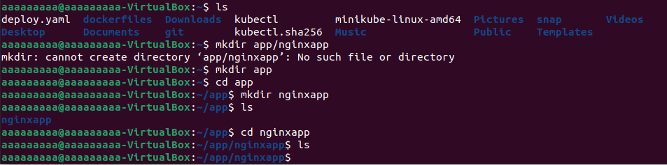

Następnie w nowo utworzonym katalogu tworzymy dockerfile - **dockerfile_error** będzie on tworzyć obraz, który ma zwracać błąd przy uruchamianiu go.  
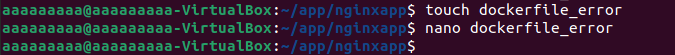

Kod do tego dockerfle jest następujący:

```
FROM nginx:latest
CMD [ "exit", "1" ]
```

Następnie trzeba zbudować wadliwy obraz nginx za pomocą polecenia `sudo docker build . -f dockerfile_error -t nginx_error`

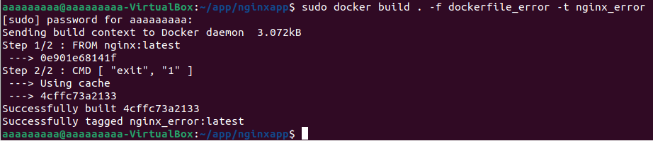

---
## **Zmiany w deploymencie**

W tej części laboratoriów będziemy aktualizować plik `deploy.yaml` i po każdej zmianie, będziemy zatwierdzać zmiany. Zanim jednak do tego przystąpię, zamieszczam pod spodem zrzut ekranu dokumentujący ilość replik przed zmianami.

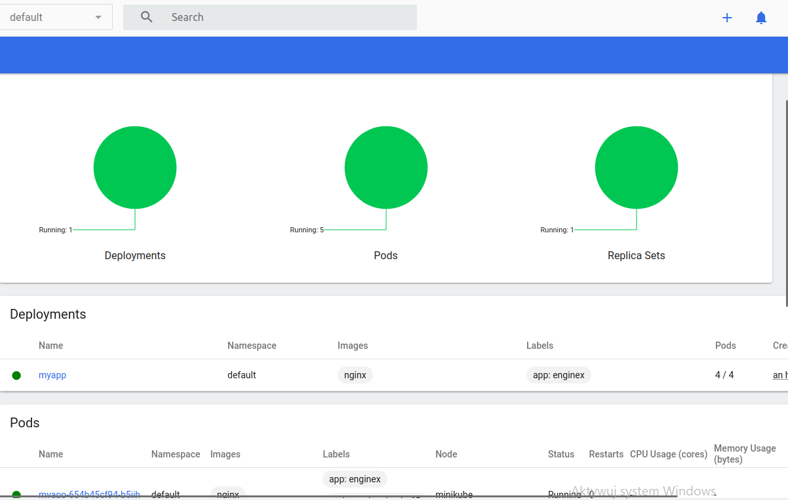

>Ilość replik zmieniamy poprzez zmianę parametru **replicas** w zakładce **spec**.

Zwiększenie liczby replik z **4** na **5**:  


---
Zmniejszenie liczby replik do **1**:  

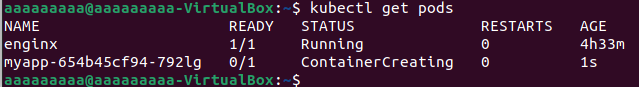

---
Zmniejszenie liczby replik do **0**:  
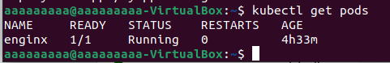

---
Uruchomienie wadliwej wersji. Wersje obrazu zmieniamy poprzez zmianę parametru **image** w zakładce **containers**.

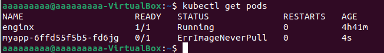

Dodatkowo zamieszczam jeszcze widok z dashboarda, po uruchomieniu wadliwej wersji obrazu:

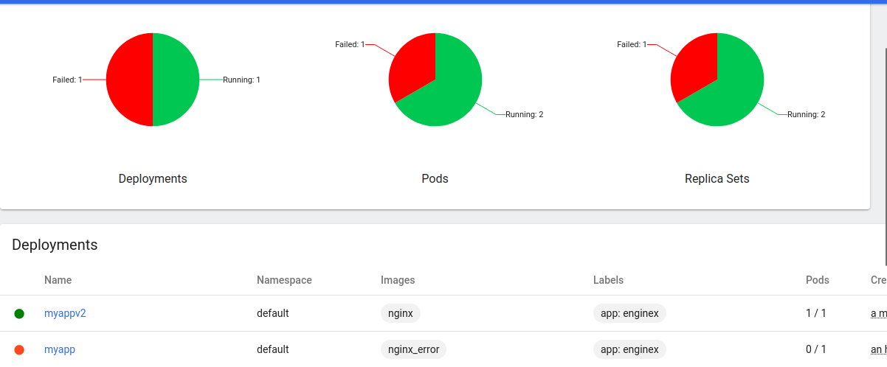
---
Uruchomienie działającej wersji:  
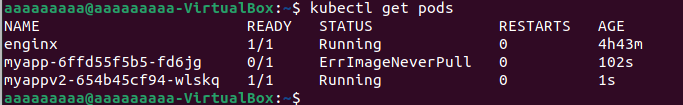

Przywrócenie poprzednich wersji wdrożeń możemy zrobić poprzez wykorzystanie komend `kubectl rollout history` i `kubectl rollout undo`:

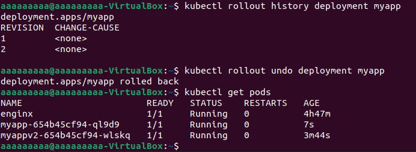  
A tutaj wyświetlenie statusu w dashboardzie po wykoaniu rollouta:

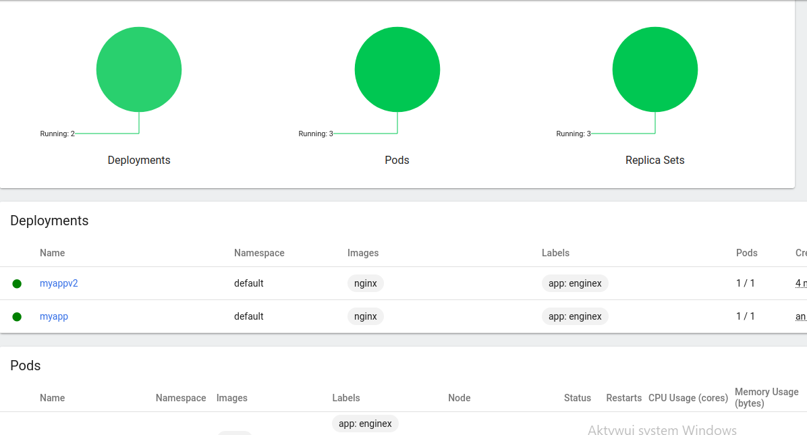

---
## **Kontrola wdrożenia**

Kontrolę wdrożenia przeprowadziłem poprzez stworzenie skryptu, weryfikującego czy wdrożenie zdążyło się wdrożyć. Po upływie 60 sekund, skrypt zwraca błąd. Pod spodem kod umieszczony w skrypcie:
```
#!/bin/bash
 
if [ $# -ne 2 ]; then
	echo "This script requires exactly 2 arguments."
	exit 1
fi
 
name=$1
deployment=$2
 
kubectl apply -f $name
timeout 60 /usr/local/bin/minikube kubectl rollout status $deployment
 
if [ $? -eq 0 ]; then
	echo "SUCCESS."
    exit 0
else
	echo "FAILURE."
    exit 1
fi
```

Efekt uruchomienia skryptu
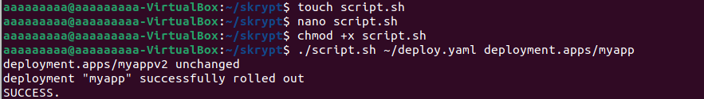


---
## **Strategie wdrożenia**

Ostatnią częścią laboratorium jest przygotowanie wersji wdrożeń stosujące trzy strategie wdrożeń: **Recreate**, **Rolling Update** oraz **Canary Deployment workload**. Każdą strategię dodajemy poprzez dodanie do pliku wdrożeniowego w zakładce `spec:` kolejnej zakadki `strategy`. Następnie trzeba tylko przypisać typ strategii, z której korzystamy poprzez dodanie: `type: TYPE`, gdzie `TYPE` jest strategią wdrożenia.

- **Strategia Recreate** - 
Strategia ta eliminuje wszystkie istniejące pody, przed stworzeniem nowych. Stosujemy poprzez ustalenie: `type: Recreate`.


- **Strategia Rolling Update** - 
Strategia ta aktualizuje wszystkie pody poprzez zakończenie ich działania, a następnie uruchomienie ich. W tym wypadku możemy także specyfikować atrybuty `maxUnavailable`, który oznacza ile podów może być maksymalnie niedostępnych podczas procesu aktualizacji oraz parametr `maxSurge`, określający ile podów może zostać dodane w określonym czasie. Stosujemy poprzez ustalenie `type: RollingUpdate`.